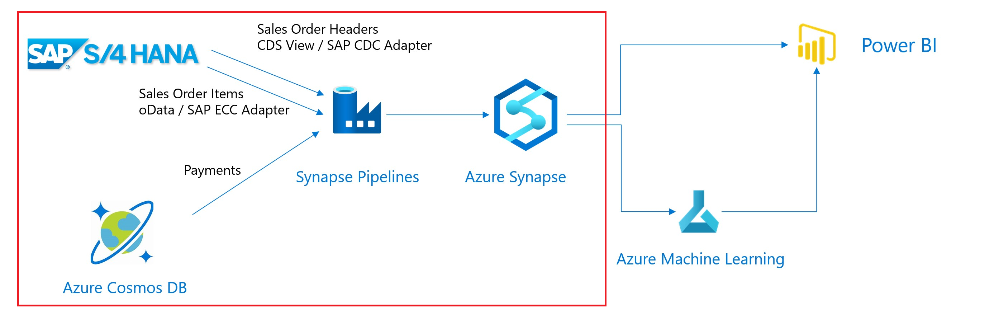
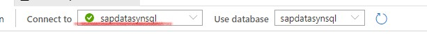
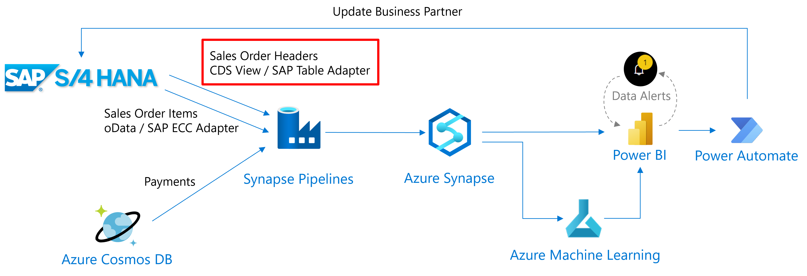
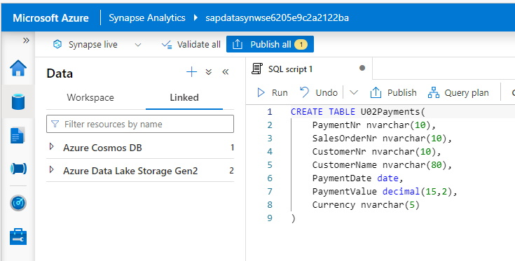
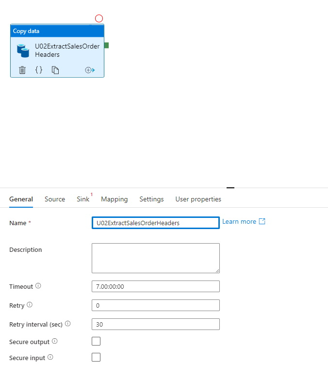
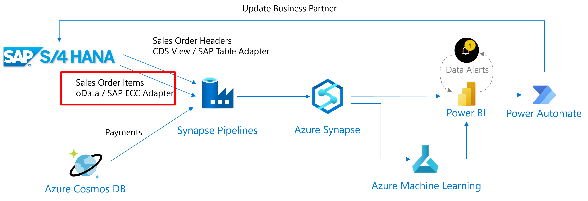
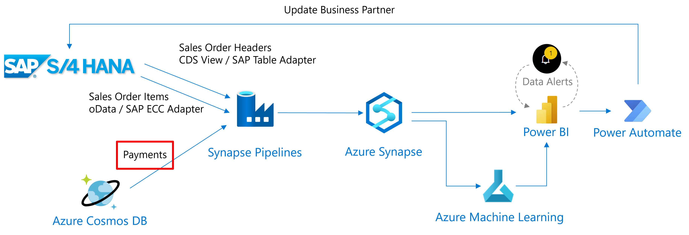

# 1 - Configure the DataFlow

**[🏠Home](./README.md)** - [ 2 PowerBI Visualization >](./PowerBiVisualisation.md)

## Introduction

In this step we'll setup the dataflow from the SAP System and Cosmos DB towards the Synapse DB. Sales OrderHeaders will be extracted via the first Synapse pipeline using the SAP Table connector, Sales Order Items will be extracted via a second Synapse Pipeline using the SAP ECC (oData) connector.
Payment data will be extracted from CosmosDB using a third pipeline.



The first step is to setup the target DB structures in Synapse.
The next step is to define the pipelines to copy the data. For this we first need to create technical connections, called `Linked Services`, to the different data sources and sinks. These `Linked Services`define the adapter to use and the corresponding connection parameters. For our example we'll need 4 `Linked Services`.

| Scenario | Source LinkedService | Sink Linked Service |
|----------|:------:|---------------------:|
| Sales Order Header | SAP Table Connector | Synapse SQL Pool MicroHack |
| Sales Order Items | SAP ECC Connector | Synapse SQL Pool MicroHack |
| Payments | CosmosDB Collection - paymentData | Synapse SQL Pool MicroHack | 

Based upon the `Linked Services`, we need to define the datasets to extract and where to write these within the target.
This is defined in `Integration Datasets`.

| Scenario | Source Integration Dataset | Sink Integration Dataset |
|----------|:------:|---------------------:|
| Sales Order Header | CDS View - `ZBD_ISALESDOC_E` | Table - `SalesOrderHeaders` |
| Sales Order Items | oData EntitySet - `C_Salesorderitemfs` | Table -`SalesOrderItems` |
| Payments | CosmosDB Collection - `paymentData` | Table - `Payments` | 

The table beneath summarizes the `Integration Datasets` and `Linked Services`.

|Scenario            |Source Integration Dataset                       | Source Linked Service |Sink Integration Dataset                               | Sink Linked Service  |
|--------------------|:-----------------------------------------------:|:---------------------:|:-----------------------------------------------------:|:--------------------:|
|Sales Order Headers | CDS View `ZBD_ISALESDOC_E` | SAP Table Connector | Synapse Table `SalesOrderHeaders` | `microHack` SQL Pool - Azure Synapse Analytics |
|Sales Order Items | oData Entity Set `C_Salesorderitemfs` | SAP ECC Connector | Synapse Table `SalesOrderItems` | `microHack` SQL Pool - Azure Synapse Analytics |
|Payments | CosmosDB Collection `paymentData` | Cosmos DB - `SAPS4D` DataBase - CosmosDB SQL API | Synapse Table `Payments` | `microHack` SQL Pool - Azure Synapse Analytics |

The last step is to define the `Synapse Pipelines`which will execute the copy. Here we link the source and sink/target datasets. This also where you can execute data mappings if necessary.

We'll start with creating tables in Synapse, which will receive the extracted data. The we'll define the extraction pipelines one by one.

## Synapse Table Setup

Create the Synapse tables in the SQL Pool
These tables are the receivers of the SAP Sales Order data and the Cosmos Payment Data.
Use the following SQL Scripts to create the tables.
You can do this via [Synapse Studio](https://web.azuresynapse.net/?workspace=%2fsubscriptions%2f67f16219-3421-4cef-89b9-c06cf90d7bea%2fresourceGroups%2fmicrohack-sap-data-rg%2fproviders%2fMicrosoft.Synapse%2fworkspaces%2fsapdatasynws56cae348989bc61e).

To create tables in Synapse follow below steps:

* Select 'Develop'


* Create SQL Scripts for each of the tables (`SalesOrderHeaders`, `SalesOrderItems`, `Payments`)


> Note: Each participant will create his/her own tables by adding a prefix U01, U02, U03, ... Make sure to change the U## in the SQL scripts to the participant number assigned you 

> Note: Make sure to change the "Connect to" value from 'builtin' to your own SQL pool as shown in the screenshot below. As by default it will be connected to the 'builtin' SQL pool of Synapse.

>

> Note: Every time you create a new object in Synapse, like a pipeline or SQL Script it is a good practice to change the default name. You can do this in the Properties window.

>

Make sure to run all the scripts in order to create the tables.

- U##SalesOrderHeaders
```sql
CREATE TABLE U##SalesOrderHeaders(
	BILLINGCOMPANYCODE nvarchar(4),
	BILLINGDOCUMENTDATE date,
	COUNTRY nvarchar(3),
	CREATIONDATE date,
	CREATIONTIME time,
	CREDITCONTROLAREA nvarchar(4),
	CUSTOMERACCOUNTGROUP nvarchar(4),
	CUSTOMERGROUP nvarchar(2),
	CUSTOMERNAME nvarchar(80),
	DISTRIBUTIONCHANNEL nvarchar(2),
	LASTCHANGEDATE date,
	LASTCHANGEDATETIME decimal(21,0),
	MANDT int,
	ORGANIZATIONDIVISION nvarchar(2),
	PRICINGDATE date,
	PURCHASEORDERBYCUSTOMER nvarchar(35),
	SALESDISTRICT nvarchar(6),
	SALESDOCUMENT nvarchar(10) NOT NULL,
	SALESDOCUMENTPROCESSINGTYPE nvarchar(1),
	SALESDOCUMENTTYPE nvarchar(4),
	SALESGROUP nvarchar(3),
	SALESOFFICE nvarchar(4),
	SALESORGANIZATION nvarchar(4),
	SDDOCUMENTCATEGORY nvarchar(4),
	SOLDTOPARTY nvarchar(10),
	TOTALNETAMOUNT decimal(15, 2),
	TRANSACTIONCURRENCY nvarchar(5),
	CITYNAME nvarchar(35),
	POSTALCODE nvarchar(10)
)
```
- U##SalesOrderItems
```sql
CREATE TABLE U##SalesOrderItems(
    SalesOrder nvarchar(10),
    SalesOrderItem nvarchar(6),
    SalesOrderItemText nvarchar(40),
    SoldToParty nvarchar(10),
    MaterialByCustomer nvarchar(35),
    MaterialName nvarchar(40),
    Material nvarchar(40),
    ShipToParty nvarchar(10),
    FullName nvarchar(80),
    SDProcessStatus nvarchar(1),
    DeliveryStatus nvarchar(1),
    SDDocumentRejectionStatus nvarchar(1),
    SalesDocumentRjcnReason nvarchar(2),
    RequestedQuantity decimal(15,3),
    RequestedQuantityUnit nvarchar(3),
    TransactionCurrency nvarchar(5),
    NetAmount decimal(16, 3),
    MaterialGroup nvarchar(9),
    Batch nvarchar(10),
    ProductionPlant nvarchar(4),
    StorageLocation nvarchar(4),
    ShippingPointName nvarchar(30),
    ShippingPoint nvarchar(4),
    SalesOrderItemCategory nvarchar(4),
    BillingBlockCriticality tinyint,
    ItemBillingBlockReason nvarchar(2),
    OrderRelatedBillingStatus nvarchar(1),
    RequestedDeliveryDate date,
    HigherLevelItem nvarchar(6),
    SalesOrderProcessingType nvarchar(1),
    RequirementSegment nvarchar(40)
)
```
- U##Payments
```sql
CREATE TABLE U##Payments(
	PaymentNr nvarchar(10),
	SalesOrderNr nvarchar(10),
	CustomerNr nvarchar(10),
	CustomerName nvarchar(80),
	PaymentDate date,
	PaymentValue decimal(15,2),
	Currency nvarchar(5)
)
```

# Implement the SalesOrderHeaders Pipeline



The sales order headers are extracted from SAP using the SAP Table Adapter which uses an RFC.
The view to extract from is : `ZBD_ISALESDOC_E`.


## Select the data to extract

Create an Integration Dataset.

This dataset will act as the `source` in our pipeline.
* Switch to the `Data` View
* Select the `Linked` Tab. 


* Create a new `Integration Dataset`


* Use type `SAP Table`


* Provide a name, U##S4DSalesOrderHeaders
* Use the `S4DCLNT100` Linked Service

* Use `ZBD_ISALESDOC_E` as table. You can wait until Synapse loads all available tables from SAP system (which can take a bit of time), or alternatively check the Edit box and enter the table name manually.

* Click `OK` 

* Use `Preview Data` to check if the data can be retrieved


* Once the information is entered successfully and the data can be retrieved, leave the tab as-is. We will publish the changes after the rest of the components of this data flow are done.

> Note : the source code of the CDS View can be found [here](scripts/zbd_i_salesdocument_e.asddls)


### Create an Integration DataSet for the Synapse Sales Orders Headers

This dataset will act as the `sink` in our pipeline.
* Switch to the `Data`View

* Create a new `Integration DataSet` for the Synapse Sales Order Headers


* As a name we used `U##SynSalesOrderHeaders` and choose `SynMicroHackPool` as a Linked Service

* Select the `U##SalesOrderHeaders` table


* Click on `OK`

* Again leave the information on the tab as-is and move to the next step

## Create an Integration pipeline

* Switch to the `Integrate` view


* Create a new `Pipeline`. Change its name to `U##ExtractSalesOrderHeaders` in the properties window


* Use the `Copy Data` activity from the `Move and transform` section from the left hand menu. Drag it to the pipeline canvas.


* Under General change the Name to `U##ExtractSalesOrderHeaders`


* In the `source` tab, select your SAP Sales Order Dataset as the source


* In the `sink` tab, select the U## Synapse Sales Order Headers Dataset as the sink
* Choose `Polybase` as the Copy Method


* In the mapping tab, choose `Import schemas`. Since source and target fields have the same name, the system can auto-generate the mapping


* In the `Settings` blade, choose `enable staging` and use the existing Linked Service to the Synapse Data Lake.

* Enter the path to the staging directory of your Azure Data Lake. The staging directory `sap-data-adls/staging`, was already created by the Terraform script.


* For the prediction model we will calculate the offset between the billing document date and the actual payment data. For this we need to have these date fields mapped to SQL Date fields. Therefore, go to the JSON Code for the pipeline and add `convertDateToDateTime` and `convertTimeToTimespan` parameters.


Add the parameters `convertDateToDatetime` and `convertTimeToTimespan` at the existing `typeproperties > source` element. The resulting document should looks as follows :

```javascript
  "typeProperties": {
                    "source": {
                        "type": "SapTableSource",
                        "partitionOption": "None",
                        "convertDateToDatetime": true,
                        "convertTimeToTimespan": true
                    },
                    "sink": { 
                        ...
```
<!-- >>Note : if these parameters are not entered correctly the date fields will remain as a String format. -->
<!-- Note : these are internal parameters!!! -->

* Click `Publish all` to save newly created objects


* Trigger the pipeline by choosing `Add trigger` -> `Trigger now` -> `OK`


* Swith to the `Monitor`view to monitor the pipeline run


* Check the result in Synapse using SQL. You can do this via the `Develop` view and create a new SQL script.

```sql
select count(*) from U##SalesOrderHeaders
select * from U##SalesOrderHeaders
```

> Note: Running the same pipeline more than once will results in duplicated rows. Ensure you truncate all rows in the table if you want to re-run the pipeline.

## Implement the SalesOrderItems Pipeline



The SalesOrderItems are extracted from SAP using the SAP ECC Connector which is based on oData. We will use the oData service at `http://<System IP>/sap/opu/odata/sap/sd_f1814_so_fs_srv/`


### Create a Integration DataSet for the SAP Sales Order Items

This dataset will act as the source for our pipeline.
* Create a `Integration DataSet` based on `SAP ECC` adapter

* Choose `U##S4DSalesOrderItems` as the name

* Use the `S4DCLNT100_ODATA` as the linked service

* Use `C_Salesorderitemfs` as path


* Click on `OK`

* Leave the information as-is and move to the next step


### Create a Integration DataSet for the Synapse Sales Order Items

This dataset will act as the sink for our pipeline.
* Create a `Integration DataSet` based on `Azure Synapse Analytics`


* Choose `SynMicroHackPool` as the Linked Service

* As a name we use `U##SynSalesOrderItems` and select the `U##SalesOrderItems` table

* Click on `OK`


### Create the integration pipeline

* Go to the `Integrate` view, and execute the same steps as for the SalesOrderHeaders data
* Create a new `Pipeline` and change the name in the Property window
* Use the `Copy` action, as name we use `U##ExtractSalesOrderItems`


* As source select the SAP SalesOrderItem oData Dataset, which we named as `U##S4DSalesOrderItems`.
* As sink, select the Synapse SalesOrderItem DataSet. We named this as `U##SynSalesOrderItems`. 
* Change the Copy Method to `Polybase`
* Under the `Mapping` tab use `Import schemas`
* Under the `Settings` tab enable and configure the `Staging Area` as done in the SalesOrderHeaders step (e.g. `sap-data-adls/staging` for the Storage Path)
* Publish, Trigger and Monitor the integration pipeline
* Create a new SQL script to check the result in Synapse

> Note: Make sure to replace the ## in the SQL scripts with the participant number assigned to you

```sql 
select count(*) from U##SalesOrderItems
select * from U##SalesOrderItems
```

> Note: Running the same pipeline more than once will results in duplicated rows. Ensure you truncate all rows in the table if you want to re-run the pipeline.

## Implement the Payment Pipeline



The Payments are extracted from CosmosDB and will be stored in a Synapse Table.


### Create a Integration DataSet for the CosmosDB Payments

This dataset will act as the source for our pipeline.
* Create a `source` DataSet for the Payment Data based on the CosmosDB `SQL API` Adapter


* As name we use `U##CosmosPaymentData`. Use collection : `paymentData`.


* Click on OK

### Create a Integration DataSet for the Synapse Payments

This dataset will act as the sink for our pipeline
* Create a `Integration DataSet` based on `Azure Synapse Analytics`


* As name we use `U##SynPayments`. Select the `U##Payments` table

### Create the Integration pipeline for the Payment flow

* Go to the `Integrate` view
* Add a new `Pipeline`
* Use the `Copy` action and name it `U##ExtractPayments`
* As source select the Cosmos DB payment Dataset, we named this `U##CosmosPaymentData`.
* As sink, select the Synapse Payment DataSet. We named this `U##SynPayments`. As Copy method choose `PolyBase`.
* Under the `Settings` tab enable and configure the `Staging Area` as done in the earlier pipelines (e.g. `sap-data-adls/staging` for the Storage Path)
* Go to the tab `Mapping` and choose `Import schemas`. Make sure to remove the mappings which are not shown in the screenshot: 
* starting with `_` and 
* also the mapping of `id`. 

You can remove them my unchecking the checkbox behind them. 
Do not forget to change the `Column name` for `Value` to `PaymentValue`.


* Publish and then trigger the integration pipeline
* Check the result in Synapse using SQL

```sql
select count(*) from U##Payments
select * from U##Payments
```

> Note: Running the same pipeline more than once will results in duplicated rows. Ensure you truncate all rows in the table if you want to re-run the pipeline.

You can now proceed with the [next](PowerBiVisualisation.md) step.
