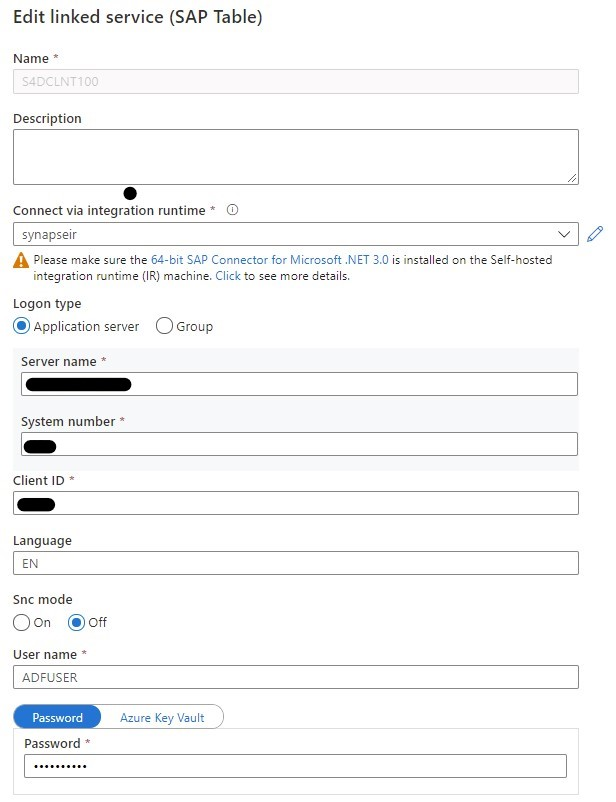
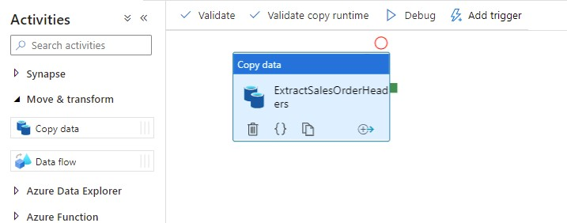
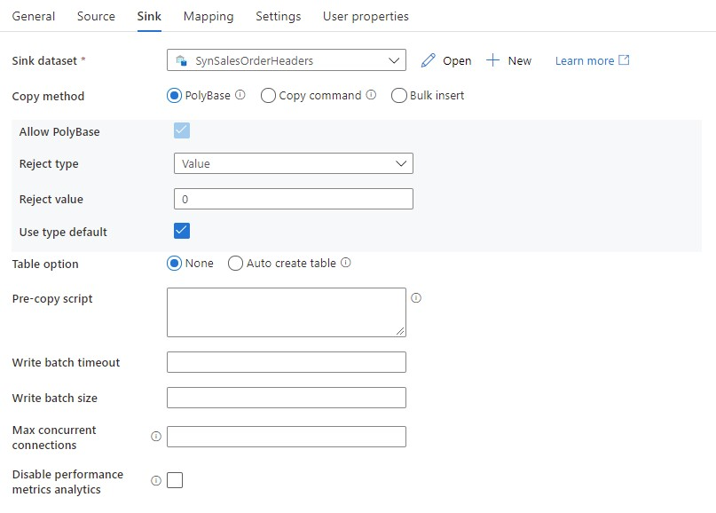
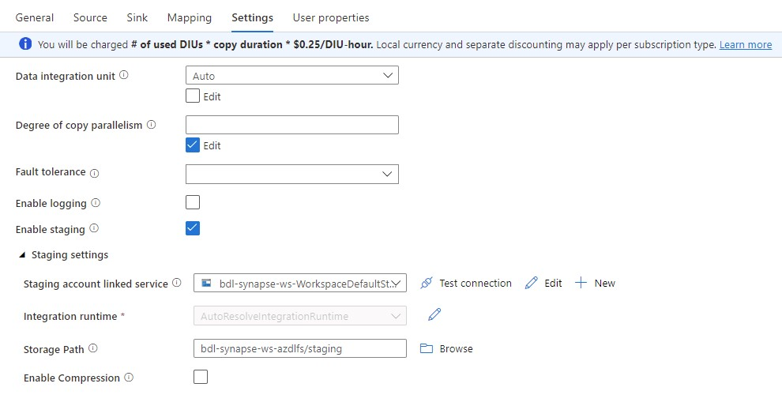
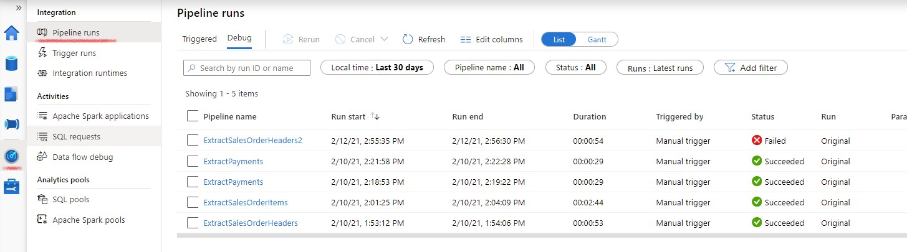
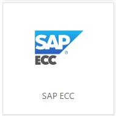
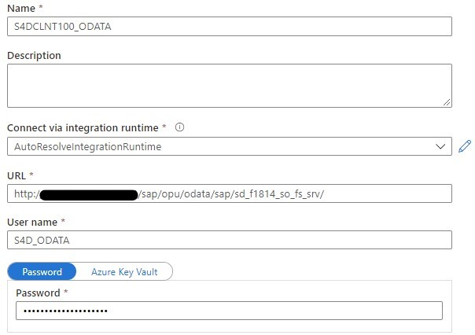
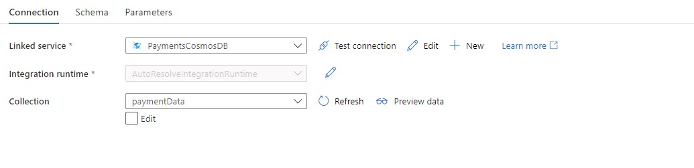

# Configure the DataFlow
## Introduction
In this step we'll setup the dataflow from the SAP System towards the Synapse System. Sales OrderHeaders will be extracted via the a first Synapse pipelinse using the SAP Table connector, Sales Order Items will be extracted via a second Synapse Pipeline using the SAP ECC (oData) connector.
Payment data will be extracted from CosmosDB using a third pipeline.
We'll first strat by setting up the target DB structures in Synapse.

## Synapse Table Setup
* Create a new SQL Pool
Choose `DW100c` as performance level (to save on costs)


* Create the Synapse tables in the SQL Pool
These tables are the receivers of the SAP Sales Order data and the Cosmos Payment Data.
Use the following SQl Scripts to create the tables.
You can this via the Synapse workspace or use the [Azure Data Studio](https://docs.microsoft.com/en-us/sql/azure-data-studio).

- SalesOrderHeaders
```sql
CREATE TABLE SalesOrderHeaders(
	BILLINGCOMPANYCODE nvarchar(4),
	BILLINGDOCUMENTDATE date,
	COUNTRY nvarchar(3),
	CREATIONDATE date,
	CREATIONTIME time,
	CREDITCONTROLAREA nvarchar(4),
	CUSTOMERACCOUNTGROUP nvarchar(4),
	CUSTOMERGROUP nvarchar(2),
	CUSTOMERNAME nvarchar(80),
	DISTRIBUTIONCHANNEL nvarchar(2),
	LASTCHANGEDATE date,
	LASTCHANGEDATETIME decimal(21,0),
	MANDT int,
	ORGANIZATIONDIVISION nvarchar(2),
	PRICINGDATE date,
	PURCHASEORDERBYCUSTOMER nvarchar(35),
	SALESDISTRICT nvarchar(6),
	SALESDOCUMENT nvarchar(10) NOT NULL,
	SALESDOCUMENTPROCESSINGTYPE nvarchar(1),
	SALESDOCUMENTTYPE nvarchar(4),
	SALESGROUP nvarchar(3),
	SALESOFFICE nvarchar(4),
	SALESORGANIZATION nvarchar(4),
	SDDOCUMENTCATEGORY nvarchar(4),
	SOLDTOPARTY nvarchar(10),
	TOTALNETAMOUNT decimal(15, 2),
	TRANSACTIONCURRENCY nvarchar(5),
	CITYNAME nvarchar(35),
	POSTALCODE nvarchar(10)
)
```
- SalesOrderItems
```sql
CREATE TABLE SalesOrderItems(
    SalesOrder nvarchar(10),
    SalesOrderItem nvarchar(6),
    SalesOrderItemText nvarchar(40),
    SoldToParty nvarchar(10),
    MaterialByCustomer nvarchar(35),
    MaterialName nvarchar(40),
    Material nvarchar(40),
    ShipToParty nvarchar(10),
    FullName nvarchar(80),
    SDProcessStatus nvarchar(1),
    DeliveryStatus nvarchar(1),
    SDDocumentRejectionStatus nvarchar(1),
    SalesDocumentRjcnReason nvarchar(2),
    RequestedQuantity decimal(15,3),
    RequestedQuantityUnit nvarchar(3),
    TransactionCurrency nvarchar(5),
    NetAmount decimal(16, 3),
    MaterialGroup nvarchar(9),
    Batch nvarchar(10),
    ProductionPlant nvarchar(4),
    StorageLocation nvarchar(4),
    ShippingPointName nvarchar(30),
    ShippingPoint nvarchar(4),
    SalesOrderItemCategory nvarchar(4),
    BillingBlockCriticality tinyint,
    ItemBillingBlockReason nvarchar(2),
    OrderRelatedBillingStatus nvarchar(1),
    RequestedDeliveryDate date,
    HigherLevelItem nvarchar(6),
    SalesOrderProcessingType nvarchar(1),
    RequirementSegment nvarchar(40)
)
```

- Payments
```sql
CREATE TABLE Payments(
	PaymentNr nvarchar(10),
	SalesOrderNr nvarchar(10),
	CustomerNr nvarchar(10),
	CustomerName nvarchar(80),
	PaymentDate date,
	PaymentValue decimal(15,2),
	Currency nvarchar(5)
)
```

# Implement the SalesOrderHeaders Pipeline
The sales order headers are extracted from SAP using the SAP Table Adapter which uses a RFC.
The view to extract from is : `ZBD_ISALESDOC_E`. You can have a look in the SAP system to check the contents. Use the Data Dictionary, transaction `SE11`.

## Create a Linked Service to the SAP System.
* In Synapse Studio, go to the `Manage` View


* Select `Linked Services`


* Create a new `Linked Service` of type `SAP Table`


* Enter the connection details for the SAP System 


>Note : use `Test Connection` to verify your settings
>Note : SAP Connection Details will be handed out at MicroHack

## Select the data to extract
Create an Integration DataSet based on the previously created `Linked Service`.
This dataset will act as the source.
* Switch to the `Data` View
* Create a new `Integration Dataset`


* Use type `SAP Table`
* Use your previously created Linked Service
* Use `ZBD_ISALESDOC_E` as table
* Use `Preview Data` to check if the data can be retrieved


## Create a Linked Service to the Synapse SQL Pool
* Switch to the `Manage` view
* Create a new Linked Service of type `Azure Synapse Analytics`


* Switch to the `Data`View

### Create an Integration DataSet for the Synapse Sales Orders
This dataset will act as the 'sink' in our pipeline.
* Create an new `Integration DataSet` for the Synapse Sales Orders
* Select the `SalesOrderHeaders` table


## Create an Integration pipeline
* Swith to the `Integrate` view
* Create a new `Pipeline`


* Use the `copy action` by dragging it onto the pipeline canvas


* In the `source` tab, select your SAP Sales Order Dataset as the source


* In the `sink` tab, select the Synapse Sales Order Dataset as the sink


* In the mapping tab, select `import Mapping`. Since source and target fields have the same name, the system can auto-generate the mapping


* For date and time fields we need to make sure the system maps these to the SQL Date fields. Therefore, go to the JSON Code and add `convertDateToDateTime` and `convertTimeToTimespan` parameters.


Add these parameters at the existing `typeproperties \ source` element :
```javascript
  "typeProperties": {
                    "source": {
                        "type": "SapTableSource",
                        "partitionOption": "None",
                        "convertDateToDatetime": true,
                        "convertTimeToTimespan": true
                    },
                    "sink": { 
                        ...
```

* In the `Settings` blade, enable staging and enter the path to the staging directory of your Azure Data Lake


* publish and trigger the pipeline


* Swith to the `Monitor`view to monitor the pipeline run

* Check the result in Synapse using SQL

```sql
select count(*) from SalesOrderHeaders
select * from SalesOrderHeaders
```

## Implement the SalesOrderItems Pipeline
The SalesOrderItems are extracted from SAP using the SAP ECC Connector which is based on oData. We'll use the oData service at `http://52.183.47.112:54000/sap/opu/odata/sap/sd_f1814_so_fs_srv/`
### Create a Linked Service to the SAP oData Service
* Create a `Linked Service`of type `SAP ECC`


* Enter the connection details\


### Create a Integration DataSet for the SAP Sales Order Items
This dataset will act as the source for our pipeline.
* Create a `Integration DataSet` based on `SAP ECC adapter`
* Use the previously created linked service
* Use `C_Salesorderitemfs`as path


### Create a Integration DataSet for the Synapse Sales Order Items
This dataset will act as the sink for our pipeline.
* Create a `Integration DataSet` based on `Azure Synapse Analytics`
* Select the `SalesOrderItems` table

### Create the integration pipeline
* Use the `Copy` action
* As source select the SAP SalesOrderItem oData Dataset
* As sink, select the Synapse SalesOrderItem DataSet
* Enter the `Staging Area`
* Publish, Trigger and Monitor the integration pipeline
* Check the result in Synapse using SQL

```sql 
select count(*) from SalesOrderItems
select * from SalesOrderItems
```

## Implement the Payment Pipeline
The Payments are extracted from CosmosDB and will be stored in a Synapse Table.
### Create Linked Service for CosmosDB
* Create a Linked Service of type CosmosDB (SQL API)


* Enter the connection parameters
Azure Cosmos DB account ARI : `https://sbx-s4d-cosmos.documents.azure.com:443`
Azure Cosmos DB access key : `<handed out at micro hack>`
Database name : `SAPS4D` 


* Test the connection and create the linked service.

### Create a Integration DataSet for the CosmosDB Payments
This dataset will act as the source for our pipeline.
* Create a 'source' DataSet for the Payment Data based on the CosmosDB 'SQL API' Adapter
* Use collection : `paymentData`


### Create a Integration DataSet for the Synapse Payments
This dataset will act as the sink for our pipeline
* Create a `Integration DataSet` based on `Azure Synapse Analytics`
* Select the `Payments` table

### Create the Integration pipeline for the Payment flow
* Use the `Copy` action
* As source select the Cosmos DB payment Dataset
* As sink, select the Synapse Payment DataSet
* Enter the `Staging Area`
* Complete the mapping between 'source' and 'sink' datasets


* Create, publish and trigger the integration pipeline
* Check the result in Synapse using SQL

```sql
select count(*) from Payments
select * from Payments
```