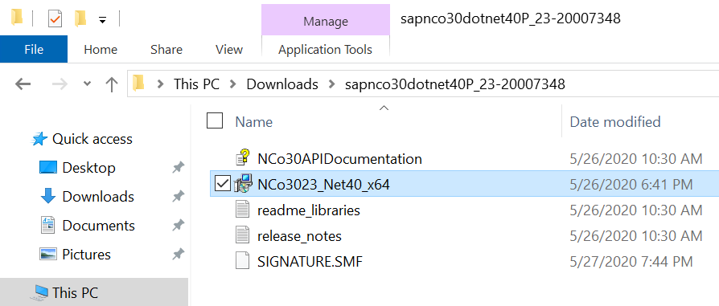
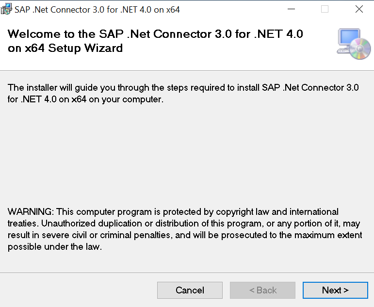
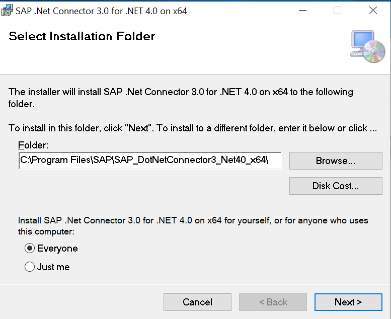
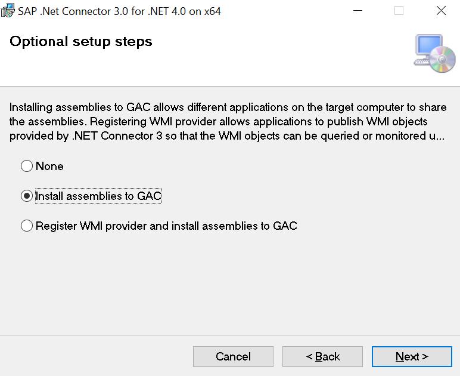

# Deploy the Microhack environment with Terraform
To avoid problems we will use Terraform to deploy a new Resource Group, Virtual Network, Subnet and Virtual Machine which will be used as the Gateway server. You can also deploy the Synapse workspace if preferred. If you don't want to deploy the Synapse workspace with Terraform you have to rename or remove the file `Synapse.tf`.

To trigger the Terraform deployment, follow the steps below:
1. Login to Azure cloud shell https://shell.azure.com/
2. Check the subscription you will be using for the Microhack: \
`az account show` \
If the subscription shown is not the right one change this with: \
`az account set --subscription "YourSubscriptionName"`
3. Clone the GitHub repository with the Terraform scripts: \
`git clone https://github.com/thzandvl/microhack-sap-data`
4. Change Directory into the terraform folder: \
`cd microhack-sap-data/terraform`
5. Run `sh setObjectID.sh`, this will set the Principle ID of your user in the file `variables.tf` as it cannot be retrieved in the Azure cloud shell.
6. Check the default values defined in `variables.tf` and change them if required. Make sure that the `object_id` is set and not only shows zeroes. Remember the username and password which you will need to login to the Gateway VM once deployed and these credentials will also be used for the Synapse workspace.
7. Download the AzureRM resource provider: \
`terraform init`
8. Run apply to start the deployment, and choose `yes` once prompted to deploy the script: \
`terraform apply`
9. Once the script is finished you will get a public IP address, this is the public IP address of the Gateway VM just deployed.
10. Use `Remote Desktop Connection` to login to the new VM and continue with the next section.


## Prepare
In this step, we'll prepare an Azure Virtual Machine to host the Integration Runtime needed by the SAP Table Connector of the Azure Synapse Pipeline.
We'll also install the SAP .net connector to enable RFC Connectivity to the SAP System.

### Install the SAP .Net Connector
The downloads can best be done directly to the Gateway VM. The VM uses Internet Explorer by default which demands you to make all the websites trusted one by one. Easiest is to download Microsoft Edge via PowerShell:
```powershell
Start-Process -FilePath "https://msedge.sf.dl.delivery.mp.microsoft.com/filestreamingservice/files/0b66d982-40c9-4487-95d4-cf22447bc879/MicrosoftEdgeEnterpriseX64.msi"
```
The first time you have to trust the website. Run the command a second time to download the Microsoft Edge MSI package. Once installed you can download the rest of the software via Microsoft Edge. \
The SAP .Net Connector can be downloaded from the [SAP Service Marketplace](https://support.sap.com/en/product/connectors/msnet.html). Make sure to download the version compiled with .Net Framework 4.0 for Windows 64-bit.

* Extract the SAP connector and open the folder 


* Start the executable 


* Press `Next` until the following screen 


* Choose `Install assemblies to GAC`, then `Next` 


* Again press `Next` and choose `Close`

The installation of the SAP .Net Connector is complete, continue to the [next](SynapseWorkspace.md) step.
