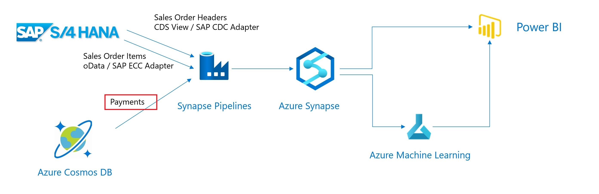

# Extract Payments using the CosmosDB Adapter

In this section we'll extract the Payments from CosmosDB and store them in a Synapse Table.



## Synapse SQL Table to receive the Payments
The extracted Payments will be saved in a SQL Table within the Synapse SQL Pool.
We will begin with creating this table using an SQL Script.

* In the Azure Portal, select your Synapse Workspace.
* Select `Open Synapse Studio`


* Select 'Develop'


* Create SQL Script


> Note: Make sure to change the "Connect to" value from 'builtin' to your own SQL pool as shown in the screenshot below. As by default it will be connected to the 'builtin' SQL pool of Synapse.

>

* Enter the connection parameters, as name we use `CosmosSAPS4D`

Azure Cosmos DB account URI : `<handed out at micro hack>`

Azure Cosmos DB access key : `<handed out at micro hack>`

Database name : `SAPS4D` 


* Test the connection and create the linked service.


## Create a Integration DataSet for the CosmosDB Payments
This dataset will act as the source for our pipeline.
* Create a `source` DataSet for the Payment Data based on the CosmosDB `SQL API` Adapter


* As name we use `CosmosPaymentData`. Use collection : `paymentData`.


## Create a Integration DataSet for the Synapse Payments
This dataset will act as the sink for our pipeline
* Create a `Integration DataSet` based on `Azure Synapse Analytics`


* As name we use `SynPayments`. Select the `Payments` table

## Create the Integration pipeline for the Payment flow
* Go to the `Integrate` view
* Add a new `Pipeline`
* Use the `Copy` action and name it `ExtractPayments`
* As source select the Cosmos DB payment Dataset, we named this `CosmosPaymentData`.
* As sink, select the Synapse Payment DataSet. We named this `SynPayments`. As Copy method choose `PolyBase`.
* Under the `Settings` tab enable and configure the `Staging Area` as done in the earlier pipelines
* Go to the tab `Mapping` and choose `Import schemas`. Make sure to remove the mappings which are not shown in the screenshot starting with `_`, you can remove them my unchecking the checkbox behind them. Do not forget to change the `Column name` for `Value` to `PaymentValue`.


* Create, publish and trigger the integration pipeline
* Check the result in Synapse using SQL

```sql
select count(*) from Payments
select * from Payments
```

You can now proceed with the [PowerBI Visualisation](PowerBiVisualisation.md) step.