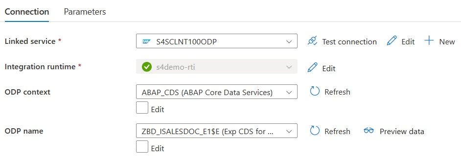
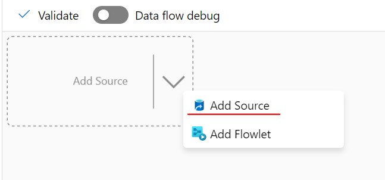

# Extract Sales Order Headers using the SAP ODP Adapter

In this section we'll extract the Sales Headers using an ABAP CDS View and the SAP ODP Adapter.

The ABAP CDS View can be found [here](scripts/zbd_i_salesdocument_e1.asddls).
Note the annotations by which the CDS View can be found in the SAP Data Dictionary (transaction SE11 or SE11n) and the annotations for Data Extraction and Delta Enablement.
Here you can see that the field 'LastChangeDateTime' is used for Delta retrievals by the ODP adapter.

```
@AbapCatalog.sqlViewName: 'ZBD_ISALESDOC_E1'
@Analytics.dataExtraction.enabled: true
@Analytics.dataExtraction.delta.byElement.name:'LastChangeDateTime'
```

## Synapse SQL Table to receive the Sales Order Headers
The extracted Sales Order headers will be saved in a SQL Table within the Synapse SQL Pool.
We will begin with creating this table using an SQL Script.

* In the Azure Portal, select your Synapse Workspace.
* Select `Open Synapse Studio`


* Select 'Develop'


* Create SQL Script


> Note: Make sure to change the "Connect to" value from 'builtin' to your own SQL pool as shown in the screenshot below. As by default it will be connected to the 'builtin' SQL pool of Synapse.

>

```sql
CREATE TABLE SalesOrderHeaders(
	BILLINGCOMPANYCODE nvarchar(4),
	BILLINGDOCUMENTDATE date,
	COUNTRY nvarchar(3),
	CREATIONDATE date,
	CREATIONTIME time,
	CREDITCONTROLAREA nvarchar(4),
	CUSTOMERACCOUNTGROUP nvarchar(4),
	CUSTOMERGROUP nvarchar(2),
	CUSTOMERNAME nvarchar(80),
	DISTRIBUTIONCHANNEL nvarchar(2),
	LASTCHANGEDATE date,
	LASTCHANGEDATETIME decimal(21,0),
	-- MANDT int,
	ORGANIZATIONDIVISION nvarchar(2),
	PRICINGDATE date,
	PURCHASEORDERBYCUSTOMER nvarchar(35),
	SALESDISTRICT nvarchar(6),
	SALESDOCUMENT nvarchar(10) NOT NULL,
	SALESDOCUMENTPROCESSINGTYPE nvarchar(1),
	SALESDOCUMENTTYPE nvarchar(4),
	SALESGROUP nvarchar(3),
	SALESOFFICE nvarchar(4),
	SALESORGANIZATION nvarchar(4),
	SDDOCUMENTCATEGORY nvarchar(4),
	SOLDTOPARTY nvarchar(10),
	TOTALNETAMOUNT decimal(15, 2),
	TRANSACTIONCURRENCY nvarchar(5),
	CITYNAME nvarchar(35),
	POSTALCODE nvarchar(10)
)
```

# Implement the Sales Order Header Pipeline


The sales order headers are extracted from SAP using the SAP ODP Adapter which uses an RFC.
The CDS View to extract from is : `ZBD_ISALESDOC_E`.
>Note: You can have a look in the SAP system to check the contents. Use the Data Dictionary, transaction `SE11`.

## Create a Linked Service to the SAP System
* In Synapse Studio, go to the `Manage` View


* Select `Linked Services`


* Create a new `Linked Service` of type `SAP CDC Connector`


* Enter the connection details for the SAP System, we used the name `S4SCLNT100ODP`. Use the username and password for the SAP system provided to you at the start of the Microhack.
* Use the Integration Runtime which you installed in the previous steps
* Enter a Subscriber Name. This name will also be used by ODP in the SAP System.


>Note : use `Test Connection` to verify your settings

>Note : SAP Connection Details will be handed out before the MicroHack

## Select the data to extract
Create an Integration DataSet based on the previously created `Linked Service`.
This dataset will act as the source.
* Switch to the `Data` View
* Create a new `Integration Dataset`


* Use type `SAP CDC`


* As a name we used `S4SalesOrderHeadersODP` and for the linked service we used the one we just created `S4DCLNT100ODP`
* Since we'll be extracting from a CDS View, use `ABAP_CDS` as ODP context
* Use `ZBD_ISALESDOC_E1$E` as ODP name, it can take some time before the list of tables is loaded



* Use `Preview Data` to check if the data can be retrieved


* Once the information is entered successfully and the data can be retrieved, leave the tab as-is. We will publish the changes after the rest of the components of this data flow are done.

> Note : the source code of the CDS View can be found [here](scripts/zbd_i_salesdocument_e.asddls)

## Create a Linked Service to the Synapse SQL Pool
* This will represent the target/sink of the pipeline

* Switch to the `Manage` view

* Create a new Linked Service of type `Azure Synapse Analytics`, as name we used `SynMicroHackPool`


>Note: Since this linked service represents the Synapse SQL pool, it will be re-used in the `SalesOrderItems`and `Payments` pipeline.

### Create an Integration DataSet for the Synapse Sales Orders
This dataset will act as the `sink` in our pipeline.
* Switch to the `Data`View

* Create a new `Integration DataSet` for the Synapse Sales Orders


* As a name we used `SynSalesOrderHeaders` and for the linked service we used the one we just created `SynMicroHackPool`

* Select the `SalesOrderHeaders` table


* Again leave the information on the tab as-is and move to the next step

## Create an Integration pipeline

* Create a new `Pipeline`, we used `ExtractSalesOrderHeaders` as a name


* Use the `DataFlow` action (within `Move & transform` by dragging it onto the pipeline canvas


* In the `General` tab, change the `Name`. We used `ExtractSalesOrderHeaders` as a name
* In the `Settings`tab, change the `Run on Azure IR` to `AutoResolveIntegrationRuntime`
* Enable `Staging`and enter the path to the staging directory of your Azure Data Lake. The staging directory `sap-data-adls/staging`, was already created by the Terraform script.


* Press `+New` to create a new DataFlow


* In the DataFlow, change the name. We used `ExtractSalesOrderHeadersDF`
* Select `Add Source`



* In `Source settings`:
    * change `Output stream name`. We used `S4SSalesOrderHeaders`
    * As `Dataset`, select the ODP dataset you create previously


* In `Source options`:
    * `Key Columns`: `SALESDOCUMENT` (Use the `Refresh` button)


* Turn on `Data Flow Debug`


* In `Projection`, select `Import projection`


>Note : Date fields like `CREATIONDATE`are detected as string.
>Note : Under "Data

* Now we need to do some date transformations. We'll do this by adding a `DerivedColumn` step
** Use `+` and then select `Derived Column`


* In `Derived column's settings`
** OutputStream Name = S4SSalesOrderHeadersUpd
** Add `Derived Columns` using the formulas beneath. 

```
CREATIONDATE = toDate(CREATIONDATE, "yyyy-MM-dd")
PRICINGDATE = toDate(PRICINGDATE, "yyyy-MM-dd")
BILLINGDOCUMENTDATE = toDate(BILLINGDOCUMENTDATE, "yyyy-MM-dd")
LASTCHANGEDATE = toDate(LASTCHANGEDATE, "yyyy-MM-dd")
CREATIONTIME = toTimestamp(concatWS(" ", toString(toDate(CREATIONDATE, "yyyy-MM-dd")), CREATIONTIME), "yyyy-MM-dd HH:mm:ss")
```


* Use the `+` button to be able to add a next step to the dataflow
* Select `Sink`


* In the `Sink` tab
** change the `Output stream name`, we used `SynSalesOrderHeaders`
** Point the `Dataset`to your DataSet linked to the Synapse Sales Order Headers


* In the `Settings`tab
** Verify `Allow insert`, `Allow delete`, `Allow upsert`, `Allow update` is checked
** KeyColums : select `SalesDocument`, this is the key column of the  SalesOrderHeader Table in Synapse.


* In the 'Mapping` tab
** Disable `Auto Mapping` to cross check the suggested mapping


* Now `Publish all` and once this is successful trigger the pipeline, use `Add trigger` -> `Trigger now` -> `OK`


* Swith to the `Monitor`view to monitor the pipeline run


* Check the result in Synapse using SQL. You can do this via the `Develop` view and create a new SQL script.

```sql
select count(*) from SalesOrderHeaders
select * from SalesOrderHeaders
```

>Note : In the SAP BackEnd you can use transaction `ODQMON - Monitor for Operational Delta Queue` to monitor the ODP extractions.


You can now continue with [Extracting Sales Order Line items](ExtractSalesOrderLineItemsUsingOData.md)

## Optional - Delta Changes
Since our ODP connector (and CDS View) allows for delta changes, you can change a Sales Order.
* Use Transaction `VA02 - Change Sales Order`
* Change the `Cust. Reference`field in the Sales Order Header


* Rerun the extraction pipeline
* Change the `SalesDocument`in the sql script beneath to the changed Sales Order

```sql
select PURCHASEORDERBYCUSTOMER from SalesOrderHeaders WHERE SalesDocument = '0000000004'
```

* Verify the result by running the sql script

You can now continue with [Extracting Sales Order Line items](ExtractSalesOrderLineItemsUsingOData.md)
