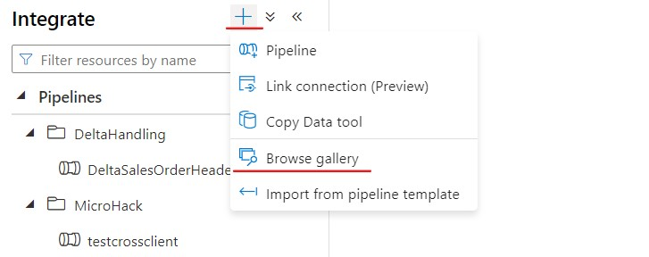
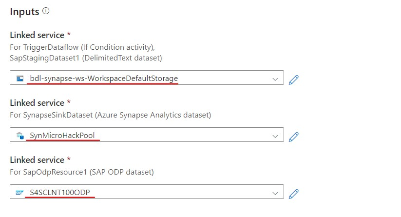
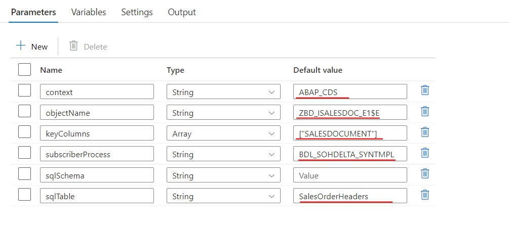

## Create the SalesOrder Header Integration pipeline using a ODP Pipeline template
In this case we're going to create the SalesOrderHeader extraction pipeline based on a Pipeline template. This Template will ensure the correct Delta handling.

* Swith to the `Integrate` view, if you're not in this view.


* Select `Add new resource` and choose `Browse Galery` to see a list of available pipelines.



* Search for `SAP` to see the SAP specific templates
* select `Replicate SAP data to Azure Synapse Analytics and persist raw data in Azure Data Lake Store Gen2`

SAPTemplate.jpg

* Press `Continue`
* The following screen gives an overview of the Pipeline.
Fill in the following
** Linked Service for SAPStagingDataset1 : this is the linked Service representing the Azure Datalake, in our case `xx-synapse-ws-WorkspaceDefaultLocation`
** Linked Service for SynapseSinkDataset : this is the linked Service representing the target Synapse Database, in our case `SynMicroHackPool`
** Linked Service for SAPOdoResource : this is the linked Service to the SAP system, in our case `S4DCLNT100ODP`



* Press `Open Pipeline`, this will generate the pipeline.
* Complete the Parameters
** context = ABAP_CDS, since we're extracting from a CDS View
** objectName = ZBD_ISALESDOC_E1$E, this is the CDS View we are extracting from
** keyColumns = ["SALESDOCUMENT"], this is the key column of the Synapse SQL table `SalesOrderHeaders`
** subscriberProcess = 
** sqlSchema = This can be left empty
** sqlTable = SalesOrderHeaders, this is the target SQL table in Synapse



* The pipeline is now ready and can be published
* Now `Publish all` and once this is successful trigger the pipeline, use `Add trigger` -> `Trigger now` -> `OK`


* Swith to the `Monitor`view to monitor the pipeline run


* Check the result in Synapse using SQL. You can do this via the `Develop` view and create a new SQL script.

```sql
select count(*) from SalesOrderHeaders
select * from SalesOrderHeaders
```

>Note : In the SAP BackEnd you can use transaction `ODQMON - Monitor for Operational Delta Queue` to monitor the ODP extractions.


## Optional - Delta Changes
Since our ODP connector (and CDS View) allows for delta changes, you can change a Sales Order.
* Use Transaction `VA02 - Change Sales Order`
* Change the `Cust. Reference` field in the Sales Order Header


* Rerun the extraction pipeline
* Change the `SalesDocument`in the sql script beneath to the changed Sales Order

```sql
select PURCHASEORDERBYCUSTOMER from SalesOrderHeaders WHERE SalesDocument = '0000000004'
```

* Verify the result by running the sql script


>Note : In the background, the pipeline is a DataFlow.

> * The `PartitionByKeyColumns` takes care of the sequence of multiple updates by sorting on the `_SQUENCENUMBER` ODP field

 * In the `AlterRowForSynapse`, you can see that for the `ApplyToSink` step a distinction is made between `Upsert` and `Delete`using the `ODQ_CHANGEMODE`

<img src="images/synapsews/alterRowForSynapse.jpg