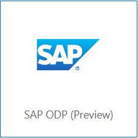

# Extract Sales Order Headers using the SAP Table Adapter

In this section we'll extract the Sales Headers using an ABAP CDS View and the SAP Table Adapter.

The ABAP CDS View can be found [here](scripts/zbd_i_salesdocument_e.asddls).
Note in the annotations the ABAP Dictionary name by which the CDS View can be found in the SAP Data Dictionary (transaction SE11 or SE11n)/

```
@AbapCatalog.sqlViewName: 'ZBD_ISALESDOC_E'
```

## Synapse SQL Table to receive the Sales Order Headers
The extracted Sales Order headers will be saved in a SQL Table within the Synapse SQL Pool.
We will begin with creating this table using an SQL Script.

* In the Azure Portal, select your Synapse Workspace.
* Select `Open Synapse Studio`


* Select 'Develop'


* Create SQL Script


> Note: Make sure to change the "Connect to" value from 'builtin' to your own SQL pool as shown in the screenshot below. As by default it will be connected to the 'builtin' SQL pool of Synapse.

>

The sales order headers are extracted from SAP using the SAP Table Adapter which uses an RFC.
The CDS View to extract from is : `ZBD_ISALESDOC_E`.
>Note: You can have a look in the SAP system to check the contents. Use the Data Dictionary, transaction `SE11`.

## Create a Linked Service to the SAP System
* In Synapse Studio, go to the `Manage` View


* Select `Linked Services`


* Create a new `Linked Service` of type `SAP Table Connector`



* Enter the connection details for the SAP System, we used the name `S4DCLNT100ODP`. Use the username and password for the SAP system provided to you at the start of the Microhack.
* Use the Integration Runtime which you installed in the previous steps


>Note : use `Test Connection` to verify your settings

>Note : SAP Connection Details will be handed out before the MicroHack

## Select the data to extract
Create an Integration DataSet based on the previously created `Linked Service`.
This dataset will act as the source.
* Switch to the `Data` View
* Create a new `Integration Dataset`


* Use type `SAP Table`


* Use your previously created Linked Service for the SAP System (Table connector), as name we used `S4DCLNT100`

* Use `ZBD_ISALESDOC_E` as table, it can take some time before the list of tables is loaded

* Use `Preview Data` to check if the data can be retrieved


* Once the information is entered succesfully and the data can be retrieved, leave the tab as-is. We will publish the changes after the rest of the components of this data flow are done.

> Note : the source code of the CDS View can be found [here](scripts/zbd_i_salesdocument_e.asddls)

## Create a Linked Service to the Synapse SQL Pool
* this will represent the target/sink of the pipeline

* Switch to the `Manage` view

* Create a new Linked Service of type `Azure Synapse Analytics`, as name we used `SynMicroHackPool`


>Note: Since this linked service represents the Synapse SQL pool, it will be re-used in the `SalesOrderItems`and `Payments` pipeline.

## Create an Integration DataSet for the Synapse Sales Orders
This dataset will act as the `sink` in our pipeline.
* Switch to the `Data`View

* Create a new `Integration DataSet` for the Synapse Sales Orders


* As a name we used `SynSalesOrderHeaders` and for the linked service we used the one we just created `SynMicroHackPool`

* Select the `SalesOrderHeaders` table


* Again leave the information on the tab as-is and move to the next step

## Create an Integration pipeline
* Swith to the `Integrate` view


* Create a new `Pipeline`, we used `ExtractSalesOrderHeaders` as a name


* Use the `copy action` by dragging it onto the pipeline canvas


* In the `source` tab, select your SAP Sales Order Dataset as the source


* In the `sink` tab, select the Synapse Sales Order Dataset as the sink


>Note : Ensure to select `PolyBase`

* In the mapping tab, choose `Import schemas`. Since source and target fields have the same name, the system can auto-generate the mapping


* For the prediction model we will calculate the offset between the billing document date and the actual payment data. For this we need to have these date fields mapped to SQL Date fields. Therefore, go to the JSON Code for the pipeline and add `convertDateToDateTime` and `convertTimeToTimespan` parameters.


Add the parameters `convertDateToDatetime` and `convertTimeToTimespan` at the existing `typeproperties > source` element. The resulting document should looks as follows :
```javascript
  "typeProperties": {
                    "source": {
                        "type": "SapTableSource",
                        "partitionOption": "None",
                        "convertDateToDatetime": true,
                        "convertTimeToTimespan": true
                    },
                    "sink": { 
                        ...
```
<!-- >>Note : if these parameters are not entered correctly the date fields will remain as a String format. -->
<!-- Note : these are internal parameters!!! -->

* In the `Settings` blade, `enable staging` and use the existing Linked Service to the Synapse Data Lake.

* Enter the path to the staging directory of your Azure Data Lake. The staging directory `sap-data-adls/staging`, was already created by the Terraform script.


* Now `Publish all` and once this is successfull trigger the pipeline, use `Add trigger` -> `Trigger now` -> `OK`


* Swith to the `Monitor`view to monitor the pipeline run


* Check the result in Synapse using SQL. You can do this via the `Develop` view and create a new SQL script.

```sql
select count(*) from SalesOrderHeaders
select * from SalesOrderHeaders
```
