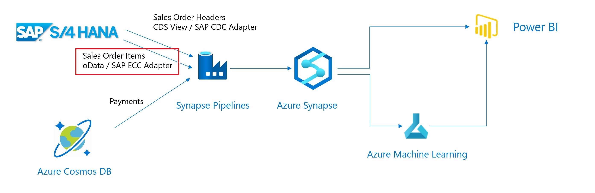

# Extract Sales Line Items using the SAP ECC Adapter

In this section we'll extract the Sales Line items using an SAP Odata Service and the SAP ECC Adapter.



The SAP oData Service is available at : `http://<SAP IP Address>:<SAP HTTP Port>/sap/opu/odata/sap/sd_f1814_so_fs_srv/`
The metadata for the oData Service can be found at : `http://<SAP IP Address>:<SAP HTTP Port>/sap/opu/odata/sap/sd_f1814_so_fs_srv/$metadata`

Here we can find that the oData entity we'll need is the `C_Salesorderitemfs`.

```
<EntityContainer Name="SD_F1814_SO_FS_SRV_Entities" m:IsDefaultEntityContainer="true" sap:message-scope-supported="true" sap:supported-formats="atom json xlsx">
    ...
    <EntitySet Name="C_Salesorderitemfs" EntityType="SD_F1814_SO_FS_SRV.C_SalesorderitemfsType" sap:creatable="false" sap:updatable="false" sap:deletable="false" sap:searchable="true" sap:content-version="1"/>
    ... 
```
Example oData url to retrieve 10 Sales Order Line Items : `http://<SAP IP Address>:<SAP HTTP Port>/sap/opu/odata/sap/sd_f1814_so_fs_srv/C_Salesorderitemfs?$top=10`

## Synapse SQL Table to receive the Sales Order Line items
The extracted Sales Order Line Items will be saved in a SQL Table within the Synapse SQL Pool.
We will begin with creating this table using an SQL Script.

* In the Azure Portal, select your Synapse Workspace.
* Select `Open Synapse Studio`


* Select 'Develop'


* Create SQL Script


> Note: Make sure to change the "Connect to" value from 'builtin' to your own SQL pool as shown in the screenshot below. As by default it will be connected to the 'builtin' SQL pool of Synapse.

>

```sql
CREATE TABLE SalesOrderItems(
    SalesOrder nvarchar(10),
    SalesOrderItem nvarchar(6),
    SalesOrderItemText nvarchar(40),
    SoldToParty nvarchar(10),
    MaterialByCustomer nvarchar(35),
    MaterialName nvarchar(40),
    Material nvarchar(40),
    ShipToParty nvarchar(10),
    FullName nvarchar(80),
    SDProcessStatus nvarchar(1),
    DeliveryStatus nvarchar(1),
    SDDocumentRejectionStatus nvarchar(1),
    SalesDocumentRjcnReason nvarchar(2),
    RequestedQuantity decimal(15,3),
    RequestedQuantityUnit nvarchar(3),
    TransactionCurrency nvarchar(5),
    NetAmount decimal(16, 3),
    MaterialGroup nvarchar(9),
    Batch nvarchar(10),
    ProductionPlant nvarchar(4),
    StorageLocation nvarchar(4),
    ShippingPointName nvarchar(30),
    ShippingPoint nvarchar(4),
    SalesOrderItemCategory nvarchar(4),
    BillingBlockCriticality tinyint,
    ItemBillingBlockReason nvarchar(2),
    OrderRelatedBillingStatus nvarchar(1),
    RequestedDeliveryDate date,
    HigherLevelItem nvarchar(6),
    SalesOrderProcessingType nvarchar(1),
    RequirementSegment nvarchar(40)
)
```

## Create a Linked Service to the SAP oData Service
* Create a `Linked Service`of type `SAP ECC`


* Enter the connection details, we used `S4DCLNT100_ODATA` as the name


## Create a Integration DataSet for the SAP Sales Order Items
This dataset will act as the source for our pipeline.
* Create a `Integration DataSet` based on `SAP ECC` adapter

* Use the previously created linked service and as a name we used `S4DSalesOrderItems`

* Use `C_Salesorderitemfs`as path


## Create a Integration DataSet for the Synapse Sales Order Items

This dataset will act as the sink for our pipeline.
* Create a `Integration DataSet` based on `Azure Synapse Analytics`, we use the linked service created earlier


* As a name we use `SynSalesOrderItems` and select the `SalesOrderItems` table


## Create the integration pipeline

* Go to the `Integrate` view, and execute the same steps as for the SalesOrderHeaders data
* Create a new `Pipeline`
* Use the `Copy` action, as name we use `ExtractSalesOrderItems`


* As source select the SAP SalesOrderItem oData Dataset, which we named as `S4DSalesOrderItems`.
* As sink, select the Synapse SalesOrderItem DataSet. We named this as `SynSalesOrderItems`. Again, change the copy method to `PolyBase`.
* Under the `Mapping` tab use `Import schemas`
* Under the `Settings` tab enable and configure the `Staging Area` as done in the SalesOrderHeaders step
* Publish, Trigger and Monitor the integration pipeline
* Create a new SQL scrtipt to check the result in Synapse

```sql 
select count(*) from SalesOrderItems
select * from SalesOrderItems
```

You can now continue with [Extracting Payments](ExtractPaymentsUsingCosmosDB.md)