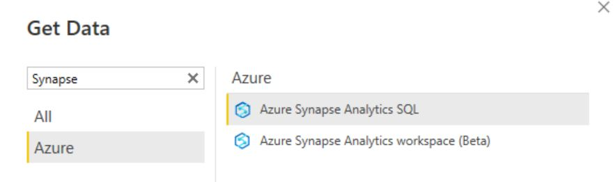
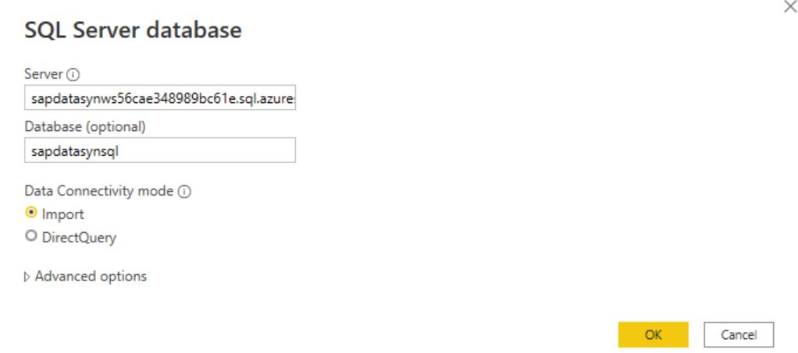
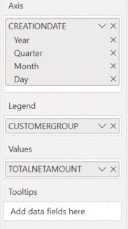
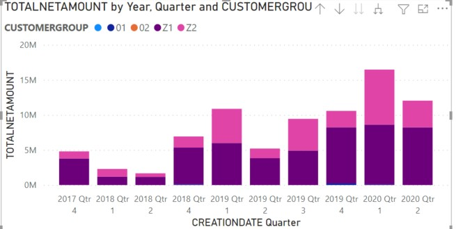
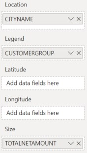
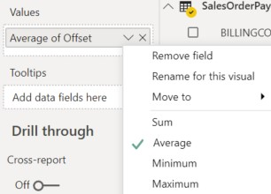

# PowerBI Visualization
In this section we'll setup some example powerBI reports.

We will be using [PowerBI Desktop](https://powerbi.microsoft.com/en-us/desktop/) for this.

## Setup & Importing Data
In PowerBI, we first need to connect to our Synapse.
* Choose `Get Data`and select `Azure Synapse Analytics SQL`



* In the next screen provide the name of the Synapse server and the database name. 

Server: `sapdatasynws56cae348989bc61e.sql.azuresynapse.net`)

Database: `sapdatasynsql`



* Confirm by clicking `Import Data`

* Use your Microsoft account to log in.

* Select the 3 tables created in the previous steps. Make sure to select the ones with your Prefix U##


* Select `Transform Data`
Columns that store the sales order number are incorrectly represented as strings. To change their types to integer, click with the right mouse button on column name and choose `Change Type -> Whole Number`. 
Apply this change to the following columns:

    * For `U##SalesOrderHeaders`, change the `SALESDOCUMENT` column. The transformation will remove the leading zeros
    * For `U##SalesOrderItems`, change the `SalesOrder` column
    * For `U##Payments`, change the `SalesOrderNr` column


You will notice that the column formula will contain additional transformation, e.g. `Table.TransformColumnTypes(dbo_SalesOrderItems,{{"SalesOrder", Int64.Type}})`.

* Select `Close & Apply`

## Create the Relational Model
In this step we'll model the relationships between the tables.
The Relationships are as follows :

`U##SalesOrderHeader 1:n U##SalesOrderItems`

`U##Payment 1:1 U##SalesOrderHeader`

* Switch to the `Model`view


* From the `SalesOrderHeaders` table, select the `SALESDOCUMENT`field and drag and drop it on the `SalesOrder`field of the `SalesOrderItems`table.
The relationship defaults to `1:*`


You can look at the relationship details by double clicking.


* In the same way create the relationship between the `U##Payments`and the `U##SalesOrderHeaders` table using the `SalesOrderNr`and `SALESDOCUMENT`field.

* The end results looks as follows :


You can now start building the reports.

# Data Visualisation
To start the visualization, switch to the `Report` view.


Some example Reports are given beneath. Feel free to experiment.

##  Sales per Date and CustomerGroup
* Select a `Stacked Column Chart`.
* Use the `SalesOrderHeaders.CREATIONDATE` hierarchy as X-axis
* Use `SalesOrderHeaders.TOTALNETAMOUNT`as Y-axis
* Use `SalesOrderHeaders.CUSTOMERGROUP`as Legend




>Note: You can drill down from `Year > Quarter > Month` due to the date hierarchy.

## Sales per Region and CustomerGroup
* Select `Map`.
* Use `SalesOrderHeaders.CITYNAME` as Location
* Use `SalesOrderHeaders.CUSTOMERGROUP` as Legend
* Use `SalesOrderHeaders.TOTALNETAMOUNT` as Bubble size




>Note: when you select a CustomerGroup and Quarter in the Sales Report, the Map report will automatically update and only show this data.


## Payments per Date and CustomerGroup
* Select a `Stacked Column Chart`
* Use `Payments.PaymentDate` hierarchy as X-axis
* Use `Payments.PaymentValue` as Y-axis
* Use `SalesOrderHeaders.CUSTOMERGROUP` as Legend

The `CustomerGroup` is retrieved via the 1:1 relationship between the `SalesOrderHeaders`and `Payments` table.


>Note : the Payments report is not identical to the Sales report. Payment of a Sales Order is typically later then the data on which the Sales Order was issued.

## Sales Per CustomerGroup and MaterialGroup
* Select a 'Stacked Bar Chart'
* Use `SalesOrderItems.NetAmount`as X-axis
* Use `SalesOrderHeaders.CUSTOMERGROUP`as Y-axis
* Use `SalesOrderItems.MaterialGroup`as Legend


## Payment Offset per CustomerGroup
With this report we'll show the average number of days by which each customergroup pays his SalesOrders. Afterwards we can compare this with the outcome of our Machine Learning Model.
For this we need to join the SalesOrderHeaders and the Payment data to calculate the number of days between the billing date and the payment date.

>Note : In the ML part you created a similar view in Synapse. This section explains how you can create a 'view' locally in PowerBI.

### Merge SalesOrderHeaders and Payments
* Under `Home` select `Transform data`
* Select the `SalesOrderHeaders`table
* Select `Merge Queries > Merge Queries as New`


* Define the merge with the Payments table
    * In `SalesOrderHeaders`select the `SALESDOCUMENT`column
    * In `Payments` select the `SalesOrderNr`column
    * Select `Inner Join`


* Rename the merged table to `SalesOrderPayments`

* By default the joined table is initially represented as a single column. To include only selected fields choose the icon on the right hand side of the `Payments` column. 

* Select `PaymentNr`, `PaymentDate`, `PaymentValue` and `Currency` fields.


* Select `Apply` under `Close & Apply`

### Calculate Payment Offset
We now need to calculate the difference between the Billing date and the actual payment date.
* From the `Report`screen select `Transform data`

* Add a new `Custom Column` to the `SalesOrderPayments` table


* Name the column `Offset`
* Use the following formula

```
Duration.Days([U##Payments.PaymentDate]-[BILLINGDOCUMENTDATE])
```

* Change the data type to `Whole Number`
* From the `Home` section use `Close & Apply` from the Home tab to switch to the data view

### Average Offset Report
* Swith to the reporting view
* Select a Stacked Column chart
* Use `SalesOrderPayments.CUSTOMERGROUP` as X-axis
* Use `SalesOrderPayments.Offset` as Y-axis
* Select `Average` instead of the default sum




### (Optional) Boxplot
If you'd like a more detailed view on the payment offset then you can use a 'Box Plot'. This gives you an idea of the variance on the offset.
For this you have to import a `Box and Whisker chart` visualization. 
In the `Visualizations` view, press the 3 dots and select `Get more visuals`.


Search for `Box and Whisker chart` and press `Add`.


You can now use the chart in your visuals

* Use `SalesOrderPayments.CUSTOMERGROUP` as `Category`
* Use `SalesOrderPayments.Offset` as `Sampling`
* Use `Average of Offset` as `Value`


From this diagram you can see that:
* CustomerGroup1 pays within 70 days +/- 10 days
* CustomerGroup2 pays within 30days +/- 5 days
* Other customergroups pay after 10 days

This should correspond to the outcome of ML Model.

Continue with the [next](PredictIncomingCashflow.md) step