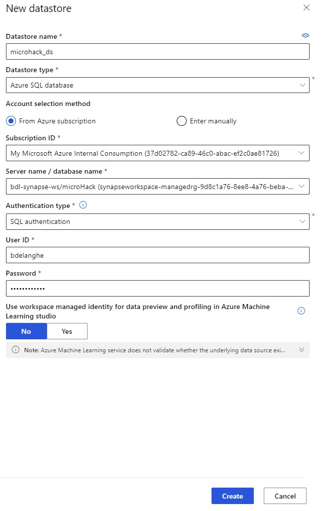
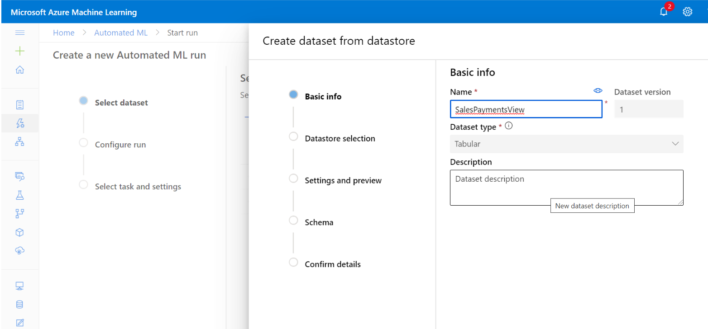
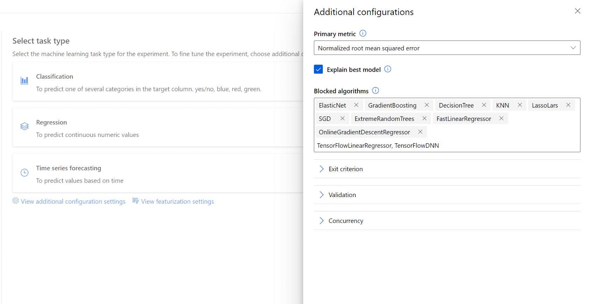

# Predict Incoming Cashflow
In this section we'll create a model to predict incoming cashflow based on historical payment delays for previous sales.

We'll be using [Azure Machine Learning](https://ml.azure.com) for this.

## Setup in Synapse
In Synapse Studio, we will create a view joining data coming from `SalesOrderHeaders` and `Payments` tables that will be used for the prediction. 
You can create this view either via Synapse Studio or via Azure Data Studio.

* Choose the `Develop` tab, select `SQL Scripts` and click on `Actions` then `New SQL Script`.


> Note : Ensure to connect to your SQL Pool

* In the newly created script tab, copy paste the following SQL Query that will execute a join between `SalesOrderHeaders` and `Payments` to create a new view.

```sql
CREATE VIEW [dbo].[SalesPaymentsFull]
	AS SELECT s.[SALESDOCUMENT]
    , s.[CUSTOMERNAME]
    , s.[CUSTOMERGROUP]
    , s.[BILLINGCOMPANYCODE]
    , s.[BILLINGDOCUMENTDATE]
    , p.[PaymentDate] as PAYMENTDATE
    , s.[CUSTOMERACCOUNTGROUP]
    , s.[CREDITCONTROLAREA]
    , s.[DISTRIBUTIONCHANNEL]
    , s.[ORGANIZATIONDIVISION]
    , s.[SALESDISTRICT]
    , s.[SALESGROUP]
    , s.[SALESOFFICE]
    , s.[SALESORGANIZATION]
    , s.[SDDOCUMENTCATEGORY]
    , s.[CITYNAME]
    , s.[POSTALCODE]
    , DATEDIFF(dayofyear, s.BILLINGDOCUMENTDATE, p.PaymentDate) as PAYMENTDELAYINDAYS
 FROM [dbo].[SalesOrderHeaders] as s
JOIN [dbo].[Payments] as p ON REPLACE(LTRIM(REPLACE(s.[SALESDOCUMENT], '0', ' ')), ' ', '0') = p.[SalesOrderNr]
```

After `Refresh`the view will appear under `Views`.


You can now test the view.


## Azure Machine Learning

* You will first have to create a Azure Machine Learning Workspace.
* In the azure portal search for `Azure Machine Learning`and select `create`


* Enter the 'Resource Group' you've been using before or create a new one. 
* Enter a `Workspace Name`
* Select the `Region` you've been using

You can now open the ML Studio from here or alternatively sign in via https://ml.azure.com.


### DataStore Creation
First you have to point the ML studio to the location of your data, which is the Synapse SQl Pool. For this you have to create a `DataStore`



### Automated ML
We'll be using `Automated Machine Learning` to predict when customers will pay for their Sales Orders/

* On the left menu, click on `Automated ML`,


* Select `New Automated ML Run`
* Select `Create Dataset` > `From datastore`


A Guided Procedure will appear :
* <b>Basic info : </b> Provide a Name for the `Dataset`

* <b>DataStore Selection : </b> Select your datastore.


* Use the following SQL query to get all the data from the view defined above.
```sql
SELECT * FROM SalesPaymentsFull
```


* <b>Settings and Preview :</b> To Ensure that your query is working fine you are able to visualize the data in the next window.


* <b>Schema :</b> In order to get a model as accurate as possible we have to do some cleaning of the data.


1. Check if an Integer type is used for any numeric field

2. Uncheck the date fields that we will not use in the model. (`BILLINGDOCUMENTDATE`, `PAYMENTDATE`)


3. Uncheck the fields that do not contain any data or which are not relevant for the forecast. Eg. `SALESDOCUMENT`, `SALESGROUP`, `SALESOFFICE` 


* <b>Confirm details</b> Create the dataset


## Configure the Automated ML Run
* Select the newly created `Dataset` and create a new experiment.


1. Specify a name.
2. Select the `Target Column` : in our case we will use `PAYMENTDELAYINDAYS` to predict the forecast.

3. Create a new compute that will be used to train your model.


* We can now select the ML task type we want to use for this experiment, as we want to build prediction on a numeric value we will select the `Regression` task type. 


* Then we need to configure the `Regression` using `Additional Configuration settings`.
1. Select `Normalized root mean squared error` as Primary metric.


2. Select all the following algorithms as blocked (useless for the regression task type) : `ElasticNet, GradientBoosting, DecisionTree, KNN, LassoLars, SGD, RandomForest, ExtremeRandomTrees, LightGBM, TensorFlowLinearRegressor, TensorFlowDNN`.
>Note : You need to add `TensorFlowLinearRegressor`, `TensorFlowDNN` manually.

3. Validate and click on `Finish`.


4. During the run you can follow-up on the tested models via the `Models` tab


>Note : The ML run will take some time. You can start with the [PowerBI section](PowerBiVisualisation.md) and return here at a later moment.

## Deploy the best model
In this step we will deploy the best model that has been trained by AutoML and test it.

* When the training is over, you can see the `Best model summary` section filled with the best algorithm, click on it.


* You can navigate into the different sections and visualize the information about this algorithm, then click on deploy.


* Specify a name for your deployment and select `Azure Container Instance` as compute type.


* Validate and wait for the completion of the deployment.


* When completed, click on the link to the `Deploy status` of the deployed model.


* In this page, you will have access to the different information of your endpoint, code samples to consume it from Python or C# but also a page to directly test your model.


## Test the Prediction
Select the `Test` tab and insert values coming from the `SalesPaymentsFull` view created at the beginning to replace the `example_value` value for the different fields and run the model.


> Note : Experiment with CustomerGroup `Z1` and `Z2` and note the Payment Delay/Offset.

You can now proceed with the [next](PowerBiVisualisation.md) step.

## [Optional] Test the ML Endpoint via HTTP
You can also test the ML model via http. You can find the URL to use via the ML `endpoint` menu.


Select your ML Model


>Note : you can have a look at the API definition using the Swagger UI

You can test the ML model via a HTTP post request on the Endpoint URI

<b>HTTP Header</b>
```
Content-Type : application/json
```
<b>HTTP Body</b>
```
{"data": [ 
    { 
    "CUSTOMERNAME": "Westend Cycles",
    "CUSTOMERGROUP": "Z1",
    "BILLINGCOMPANYCODE": 1710,
    "CUSTOMERACCOUNTGROUP": "KUNA",
    "CREDITCONTROLAREA": "A000",
    "DISTRIBUTIONCHANNEL": 10,
    "ORGANIZATIONDIVISION": 0,
    "SALESDISTRICT": "US0003",
    "SALESORGANIZATION": 1710,
    "SDDOCUMENTCATEGORY": "C",
    "CITYNAME": "RALEIGH",
    "POSTALCODE": "27603"
    },
    { 
    "CUSTOMERNAME": "Skymart Corp",
    "CUSTOMERGROUP": "Z2",
    "BILLINGCOMPANYCODE": 1710,
    "CUSTOMERACCOUNTGROUP": "KUNA",
    "CREDITCONTROLAREA": "A000",
    "DISTRIBUTIONCHANNEL": 10,
    "ORGANIZATIONDIVISION": 0,
    "SALESDISTRICT": "US0004",
    "SALESORGANIZATION": 1710,
    "SDDOCUMENTCATEGORY": "C",
    "CITYNAME": "New York",
    "POSTALCODE": "10007"
    }
]}
```

The result will looks as follows :
```
"{ "result": [30.966167923963926, 70.18799357457902]}"
```

>Note : if you're using `Postman`, you can find a sample test at [Postman Sample Test](scripts\MicroHack.postman_collection.json)
