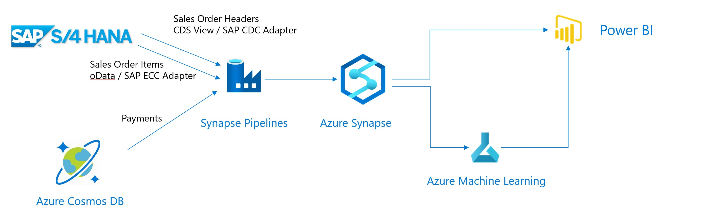

# SAP Microhack: CashFlow Prediction

In this Microhack we will:

* **Extract** (historical) Sales Orders from SAP S/4HANA and load this in Synapse
* **Upload** historical payments from a non-SAP system, in this example Cosmos DB, to Synapse
* **Visualize** the extracted Sales Orders and invoice data with Power BI
* **Predict** incoming cash flow forSales Orders
* **Trigger** actions in SAP based on insights gained from the prediction

## Scenario Description

When customers buy goods, the corresponding payments are not done immediately. Some customers will pay directly and other customers will pay at end of the payment terms. This makes it difficult for companies to predict the incoming cashflow. In this simplified exercise we'll use Azure tooling to predict the incoming cashflow. For this we need data on past Sales Orders and past payments. The Sales Order information we'll retrieve from an S/4HANA system. For the payments we assume these are kept in a non SAP system. This non-SAP System is represented by a Cosmos DB.

## Setup

The implementation steps beneath assume you've setup a S/4HANA system based upon a `SAP S/4HANA Fully Activated Appliance` 1909 or 2020 image from [SAP CAL](http://cal.sap.com). Also a Cosmos DB were the corresponding payment data is uploaded is assumed to be available.
If you want to setup your own SAP CAL system and Cosmos DB, follow the steps at [MicroHack Setup](setup/SAPCALSetup.md).

## Implementation

To execute the Microhack follow the steps below:

1. [DataFlow Config](DataFlowConfig.md)
2. [PowerBI Visualization](PowerBiVisualisation.md)
3. [Predict Cash Flow](PredictIncomingCashflow.md)
4. [Integrate ML and PowerBI](IntegrateMLPowerBI.md)
5. [Create Alerting Rule](CreateAlertingRule.md)
6. [Take Actions in the SAP system](UpdateInformationInSap.md)

## Additional Documentation

* [Copy data from an SAP table using Azure Data Factory](https://docs.microsoft.com/azure/data-factory/connector-sap-table)
* [Copy data from SAP using oData and Azure Data Factory](https://docs.microsoft.com/azure/data-factory/connector-sap-ecc)
* [SAP Data Integration using Azure Data Factory](https://github.com/Azure/Azure-DataFactory/blob/main/whitepaper/SAP%20Data%20Integration%20using%20Azure%20Data%20Factory.pdf)
* [SAP Data Extraction using Azure Data Factory (Examples)](https://github.com/bdelangh/ADF_SAPDataExtraction)
* [What is Azure Machine Learning](https://docs.microsoft.com/azure/machine-learning/overview-what-is-azure-ml)
