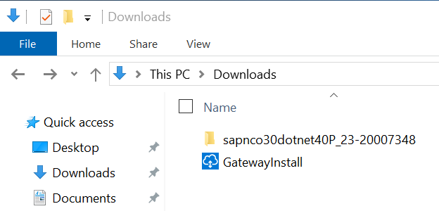
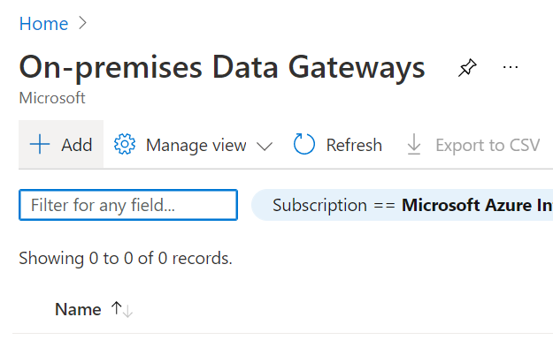
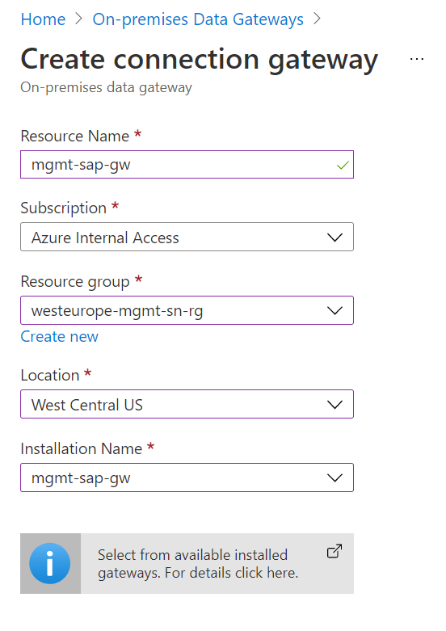

# SAP Microhack: CashFlow Prediction
For this Microhack we will:
* Extract (Historical) Sales Orders from SAP S/4HANA and load this in Synapse
* Upload historical payments from a non-SAP system, in this example Cosmos DB, to Synapse
* Visualize the extracted Sales Orders and invoice data with Power BI
* Predict incoming cash flow for new Sales Orders

To start with the Microhack we first need to take some preparation steps:

## Deploy a gateway server for the SAP RFC connection
### Basics

In your subscription create a new VM with a very small size, in this example I used the B2s, with Windows Server 2019 Datecenter.

### Disks

We don't need any additional disks, but you can change the OS disk type to "Standard HDD" as we don't need any performance.

### Networking

Choose the Virtual Network you already have in your subscription or create a new Virtual Network if you don't have any. And choose a subnet where your new VM will be part of. Add a new public IP address to make sure you can logon to the system.

### Create

The steps management, advanced and tags can be skipped and you can directly jump to "Review + Create".

## Prepare the Gateway server
Make sure port 3389 is open on your Network Security Gateway and logon to the system. Two components need to be installed to activate the system as a gateway system for the SAP connection:

1. The SAP table connector. More information can be found [here](https://docs.microsoft.com/en-us/azure/data-factory/connector-sap-table). And you can download the connector [here](https://support.sap.com/en/product/connectors/msnet.html). Make sure to choose the 64-bit connector compiled with .NET Framework 4.0.
2. The on-premises data gateway. More information can be found [here](https://docs.microsoft.com/en-us/azure/logic-apps/logic-apps-gateway-install). And you can download the gateway [here](https://www.microsoft.com/en-us/download/details.aspx?id=53127).

Logon to the Gateway VM deployed in the earlier steps. Easiest is to download the table connector and the data gateway on your local environment and copy them to the Gateway VM.

### Install the SAP Table Connector
Extract the SAP connector and open the folder.

Start the executable

Press next until the following screen 

Choose "Install assemblies to GAC", Next

Again Next and choose Close

The installation of the SAP Table connector is complete, continue to the next step.

### Install the on-premises gateway
Start the GatewayInstall executable. For the installation it is easier to follow the steps as mentioned in [this](https://docs.microsoft.com/en-us/azure/logic-apps/logic-apps-gateway-install#install-data-gateway) link. If you want to change the region you have to do it during the installation, it can be done in the same screen as where you define the recovery key!

Next step is to configure the on-premises gateway from the Azure Portal. The instructions can be found [here](https://docs.microsoft.com/en-us/azure/logic-apps/logic-apps-gateway-connection).

1. Create new on-premises gateway

Choose add

2. Choose the right parameters

Choose the same location as the one defined during your gateway installation on the VM otherwise you cannot select your installation name.

You now successfully prepared the Gateway VM!