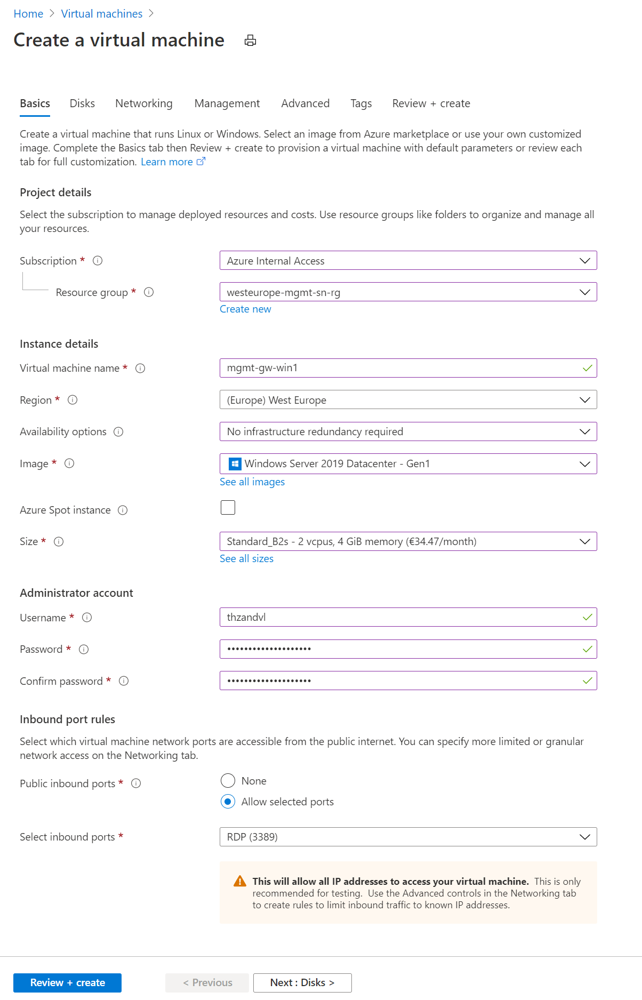
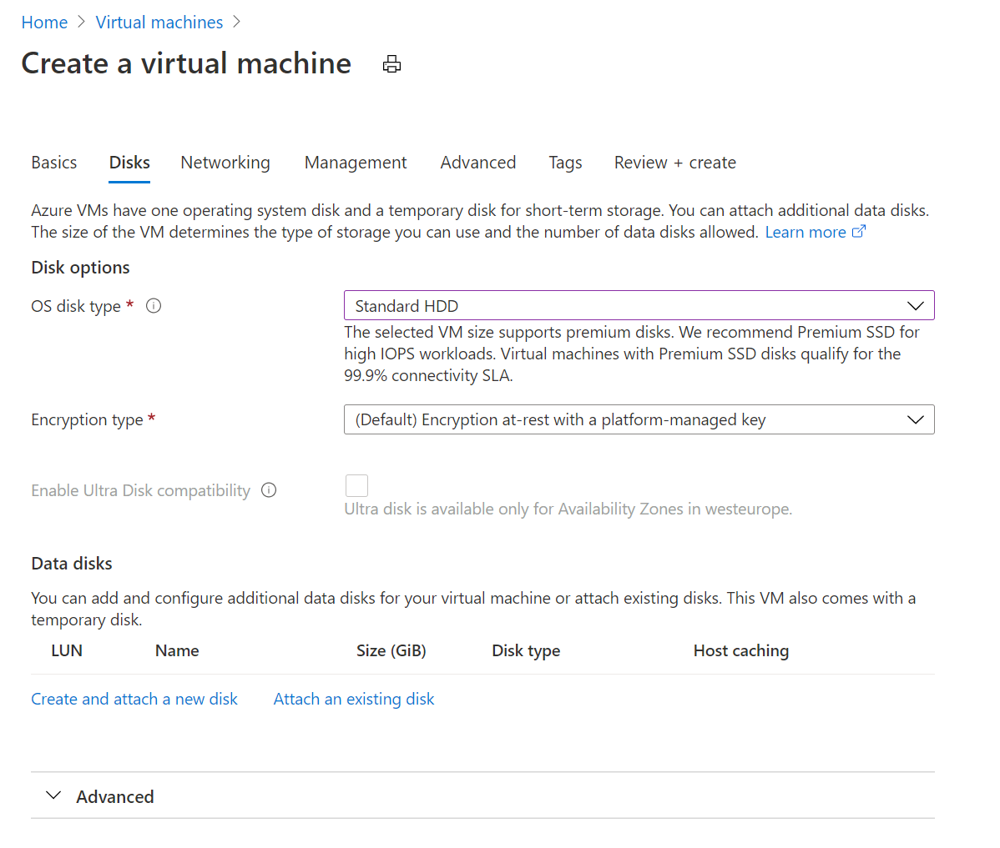

# SAP Microhack: CashFlow Prediction
For this Microhack we will:
* Extract (Historical) Sales Orders from SAP S/4HANA and load this in Synapse
* Upload historical payments from a non-SAP system, in this example Cosmos DB, to Synapse
* Visualize the extracted Sales Orders and invoice data with Power BI
* Predict incoming cash flow for new Sales Orders

To start with the Microhack we first need to take some preparation steps:

## Deploy a gateway server for the SAP RFC connection
### Basics

In your subscription create a new VM with a very small size, in this example I used the B2s, with Windows Server 2019 Datecenter.

### Disks

We don't need any additional disks, but you can change the OS disk type to "Standard HDD" as we don't need any performance.

### Networking

Choose the Virtual Network you already have in your subscription or create a new Virtual Network if you don't have any. And Choose a subnet where your new VM will be part of. No Public IP address is required for this demo.

### Create

The steps management, advanced and tags can be skipped and you can directly jump to "Review + Create".

## Connect to the Gateway server
