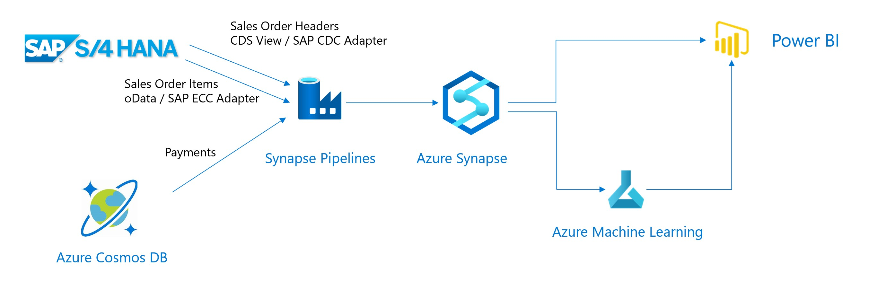

# SAP Microhack: CashFlow Prediction
## Summary
For this Microhack we will:
* Extract (Historical) Sales Orders from SAP S/4HANA and load this in Synapse
* Upload historical payments from a non-SAP system, in this example Cosmos DB, to Synapse
* Visualize the extracted Sales Orders and invoice data with Power BI
* Predict incoming cash flow forSales Orders

## Scenario Description
When customers buy goods, the corresponding payments are not done immediatly. Some customers will pay directly and other customers will pay at end of the payment terms. This makes it diffucult for companies to predict the incoming cashflow. In this simplified exercise we'll use Azure tooling to predict the incoming cashflow. For this we need data on past Sales Orders and past payments. The Sales Order information we'll retrieve from an S/4HANA system. For the payments we assume these are kept in a non SAP system. This non-SAP System is represented by a Cosmos DB.

## Implementation
To execute the Microhack follow the steps below:

0. [Software Prerequisites](SoftwarePrerequisites.md)
1. [Deploy and Prepare the Microhack Environment](DeployEnvironment.md)
2. [Synapse Workspace Setup](SynapseWorkspace.md)
3. [DataFlow Config](DataFlowConfig.md)
4. [Predict Cash Flow](PredictIncomingCashflow.md)
5. [PowerBI Visualisation](PowerBiVisualisation.md)
6. [Integrate ML and PowerBI](IntegrateMLPowerBI.md)
7. [Cleanup the Microhack Environment](CleanEnvironment.md)

## Setup
This section shortly describes the setup needed to run your own MicroHack. It also contains tooling to generate your own payments.
[Micro Hack Setup](setup.md)