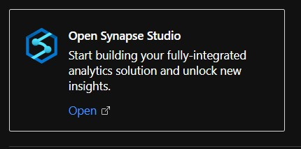
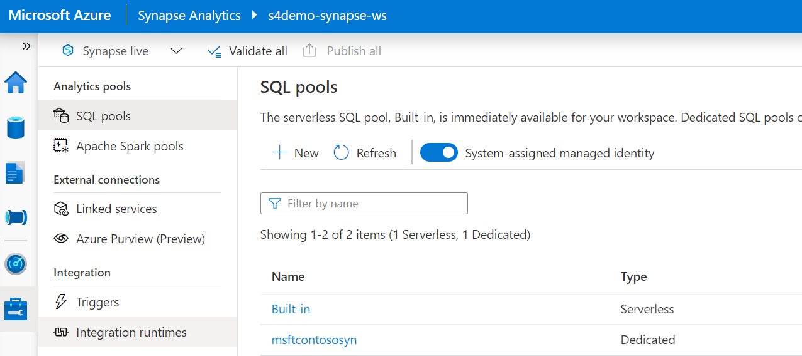
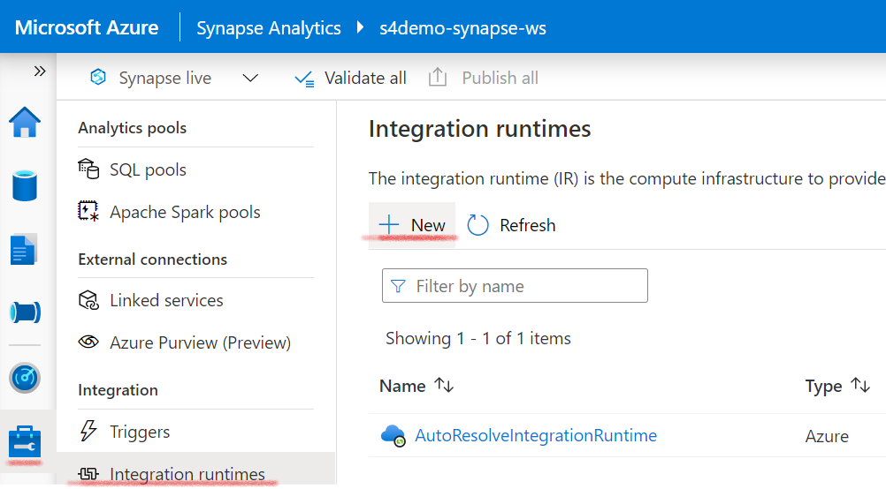
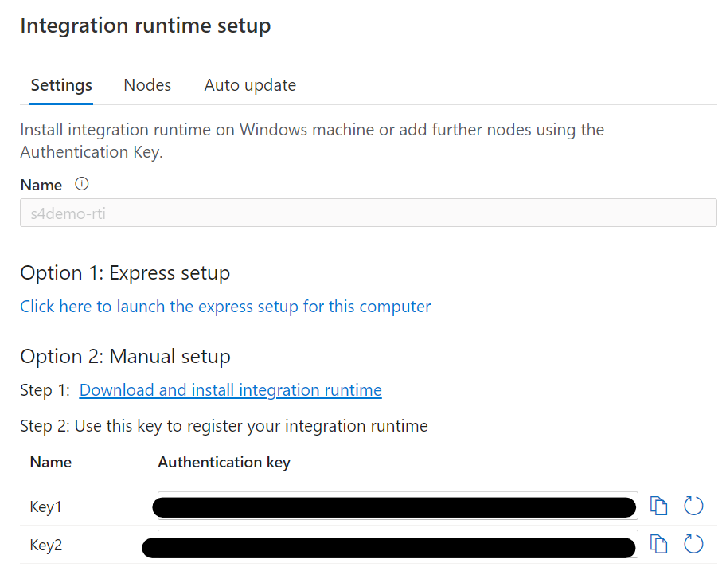
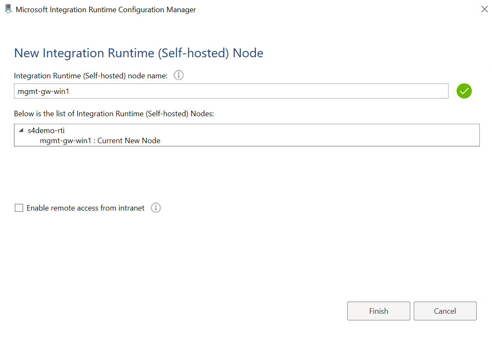
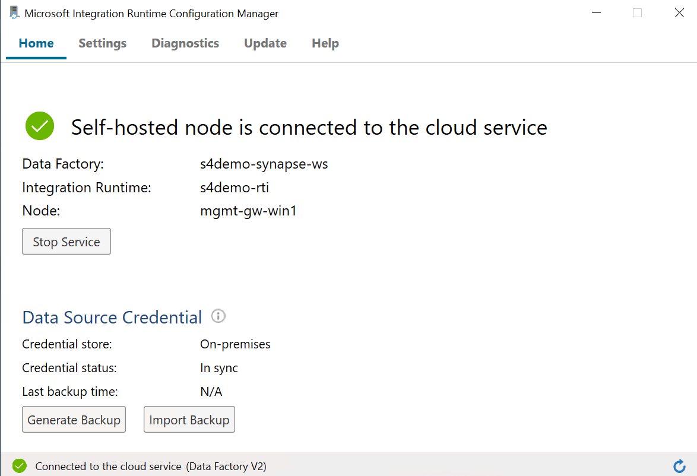

# Synapse Workspace

## Introduction
In this part we'll create the Synapse Workspace and install the Ingration Runtion on our Azure Virtual Machine.

## Creation
* Create a Synapse Analytics Workspace\

Enter the following settings :
### Basics :
* Resource Group
* Workspace Name
* Data Lake Storage : Select an existing Data Lake or create a new one
* File System Name : Select an exising File System or create a new one

### Security :
* Admin Username & Password : this will be there userId and password for the related SQL Pools.

Other settings can remain as default.

# After deployment :
* Create a `staging` directory within the Synapse Azure Data Lake container. This directory is used for storage of temporary files during data upload to Synapse.

* Create a new SQL Pool\
Choose `DW100c` as performance level (to save on costs).

# Synapse Configuration
The configuration is done via `Synapse Studio`:\

## Register Integration Runtime
To register the integration runtime click on manage:

* Click on `Integration runtimes`:\

* Click on `+ New`:\

* Choose `Self-Hosted`:\

* Choose a name for the runtime installation:\

* You will receive two key values. Make sure to note these down, in the next step you need one of these keys\

* In `Option 2: Manual setup` you can download the integration runtime via `Step 1`. Donwload the installation file and upload it to your VM.

* Login on the Gateway VM and copy the integration runtime MSI package to the download folder, or any other folder you prefer.
Execute the MSI package and press `next` until you get the question for the `authentication key`:\

* Enter one of the keys you noted down earlier from integration runtime setup and choose `Register`.

* Enter the name of the integration runtime node configured earlier\

* Choose `Finish`\

The installation is done and the node is connected and can be used.
You can now proceed with the next step.