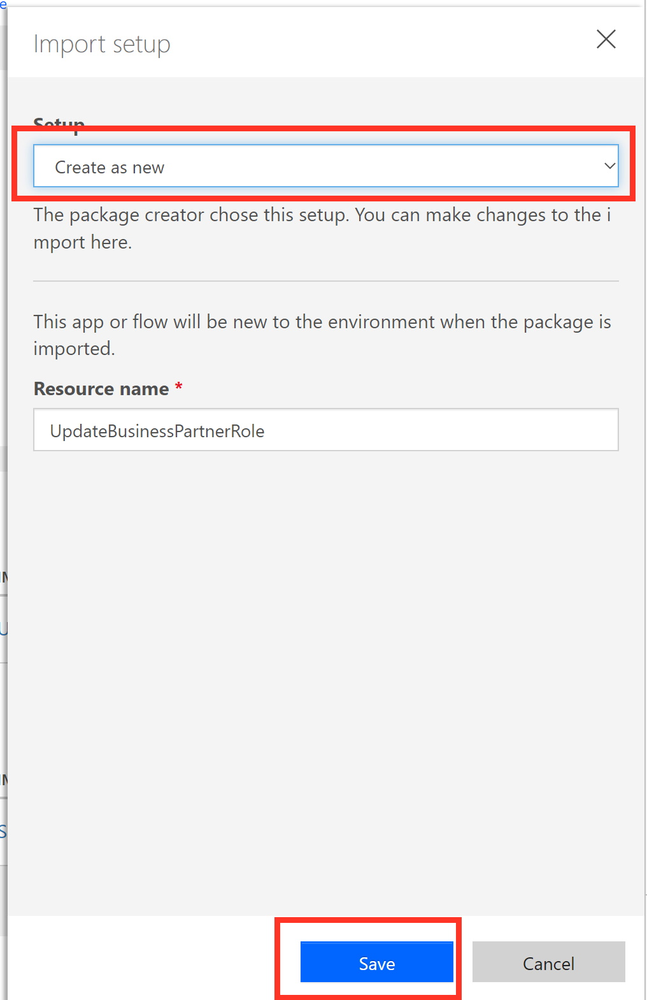
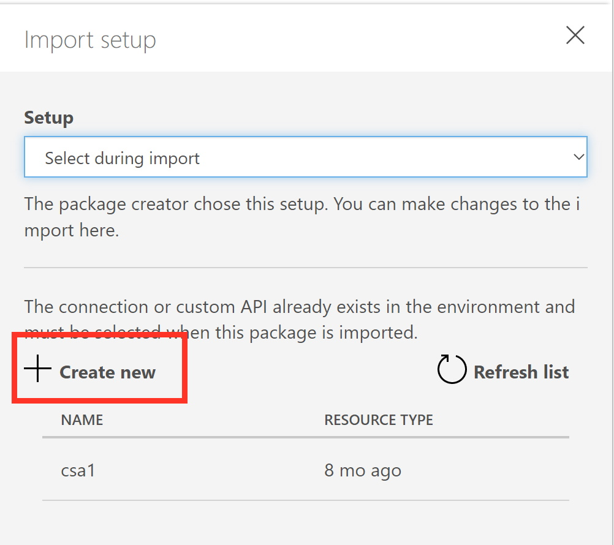
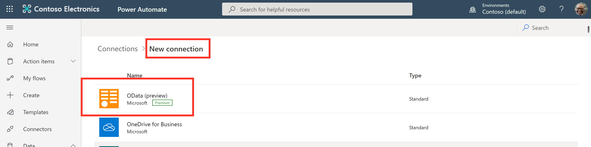
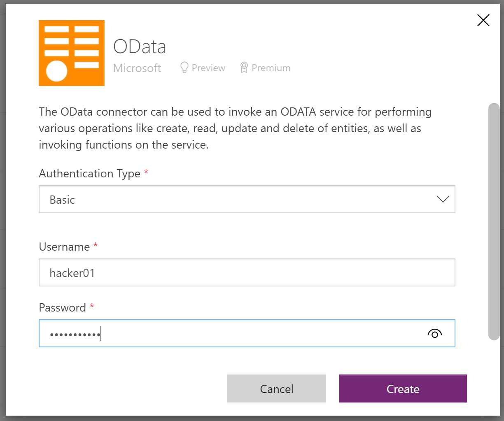

# 6 - Take Actions in the SAP system

[< 5 Create Alerting Rule](./CreateAlertingRule.md) - **[🏠Home](./README.md)**

As a final step we want to take actions with the information that we saw in the Power BI Dashboard. 
Thanks to the ML and alerting functionality we can easily identify payers, whose payment is typically delayed. In order to flag them in the SAP system (as "bad payers") we want to add a feature to our Power BI Dashboards that quickly can flag such a customer as a "bad payer" in the SAP system.

For this we have created a simple Power Automate flow that calls the OData service to update the Business Partner role from "Customer" to "Bad Payer Customer".

## Import Power Automate Flow

* Open [https://flow.microsoft.com/](https://flow.microsoft.com/) and click on `My Flows` -> `Import` to import the preconfigued Power Automate Flow that updates the Business Partner Role
 

* Click on Upload and select the `BusinessPartnerRole` ZIP file
 

* Click on the `Action` item to create the new flow in your environment.
 

* Select `Create as new` and click on `Save`
 

* Next click on the `Action` item next to the OData Connector and click on `+ Create New User`
 

* A new Browser-Tab will open. Click on `+ New Connection` and search for the OData Connector and select it
 

* Enter the username and password for the connection and click on `Create`
 

* Switch back to the previous screen where you imported the Flow, click on `Refresh`, select the newly created users and click on `Save`
 

* If required to the same for the `Power BI Connection`. From the New Connectors list, search for Power BI and provide your Power BI credentials.

* With this you should be able to `Import` the flow in your environment. 
 

## Activate the Flow

* Go back to `My Flows`and select the UpdateBusinessPartnerRole flow
 

* Click on the three dots and activate the flow by clicking `Turn On`
 

## Adding Power Automate to Power BI Dashboard

* Now switch back to the Power BI Dashboard and make sure that you are in the Edit Mode
 

* From the visual pane, select the `Power Automate` visual
 

* !!!!!!!!!!!! here we would map the customer id to the Power Automate flow !!!!!!!!!!!
* Once the Power Automate visual is added, click on the three dots and select `Edit`
 

* The Power Automate Screen should open. Wait till the flow page is fully loaded and click on the UpdateBuisnessPartnerRole flow
 

* Click on Apply to make the Power Automate Flow available in the Power BI Dashboard. Then click on `Back to Report` to return to the Power BI Dashboard
 

You finished the Microhack :-) return [🏠Home](./README.md)?
